# AWS CloudFormation Mastery — Lab Documentation

---

## Introduction

This documentation records a hands-on CloudFormation lab I completed working across three levels of infrastructure complexity. Rather than clicking through the AWS console to provision resources manually, each level involved writing a CloudFormation template, deploying it as a stack, and observing how AWS orchestrates the provisioning process.

The three levels I worked through each demonstrate a distinct concept:

- **Level 5 — [Compute & Wiring: EC2, Security Groups & Intrinsic Functions]:** Demonstrates how to set up EC2 instances with security groups and use intrinsic functions for dynamic resource configuration.

- **Level 6 — [Composition: Nested Stacks]:** Demonstrates how to break down complex infrastructure into reusable nested stacks.

- **Level 7 — [Dynamic Intelligence: Custom Resources]:** Demonstrates how to extend CloudFormation's capabilities by creating custom resources that can execute arbitrary logic during stack operations.

By completing these levels, I developed a practical understanding of:

- How CloudFormation templates are structured and validated
- How Stack Events expose exactly what AWS is doing — and where it fails
- How parameters, outputs, and resource dependencies work together
- How rollback behaviour protects infrastructure consistency
- How to iterate on a template based on real deployment errors

---

## Level 5 — Compute & Wiring: EC2, Security Groups & Intrinsic Functions

### What This Level Demonstrates
This level demonstrates how to provision an EC2 instance with a security group, and how to use intrinsic functions to dynamically configure resources based on parameters and other resource attributes.
### Template Overview

> Template file: [`webserver.yaml`](templates/webserver.yaml)

**Key resources defined:**
- **Web Server EC2 Instance:** The virtual server that will run the web application.
- **Web Server Security Group:** Defines the firewall rules that control inbound and outbound traffic to the EC2 instance.
- **Key parameters:**
  - **InstanceType:** Allows the user to specify the type of EC2 instance to launch
  - **KeyName:** The name of the SSH key pair to allow secure access to the instance.

### Prediction

Before deploying, I expected the following outcomes due to content of the template:
- The EC2 instance will be launched with the specified instance type and key pair.
- The security group will allow inbound traffic according to the defined rules.
- An output will be generated with the public IP address of the EC2 instance.

### Steps & Observations

#### Step 1: Creating the Stack

**Console action Screenshot:**

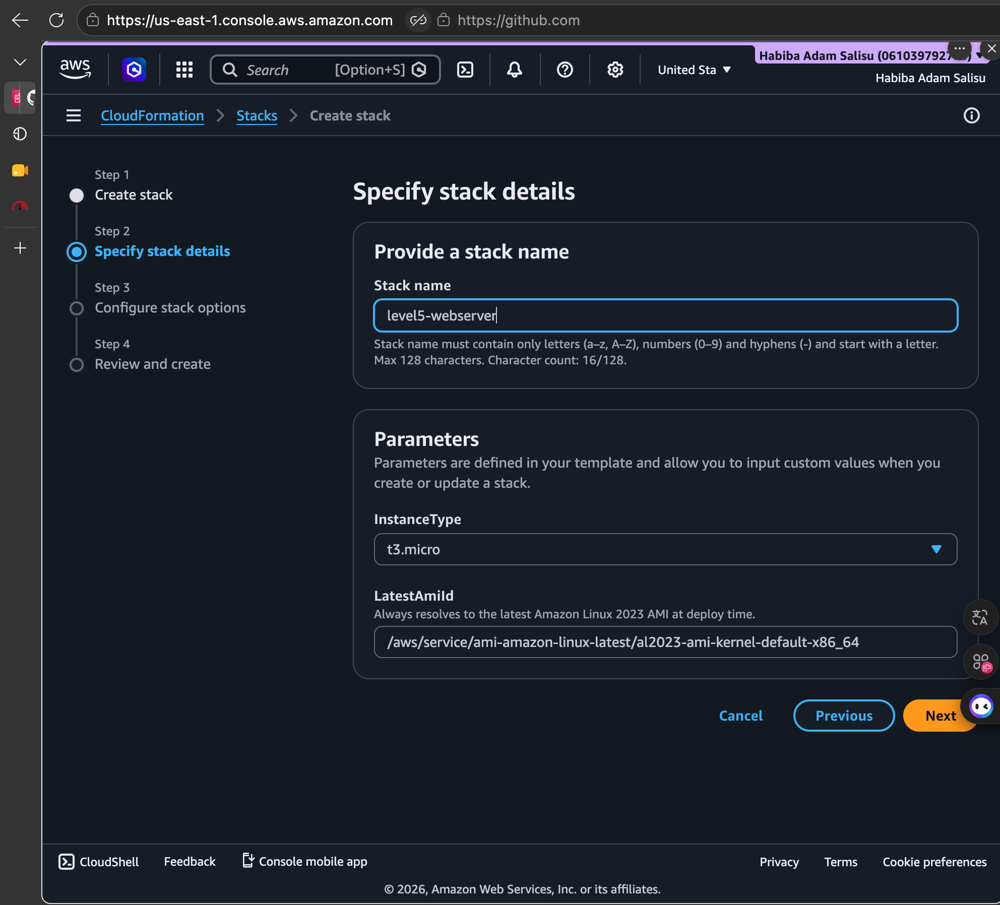

**Stack Outcome/Creation Output Screenshot:**

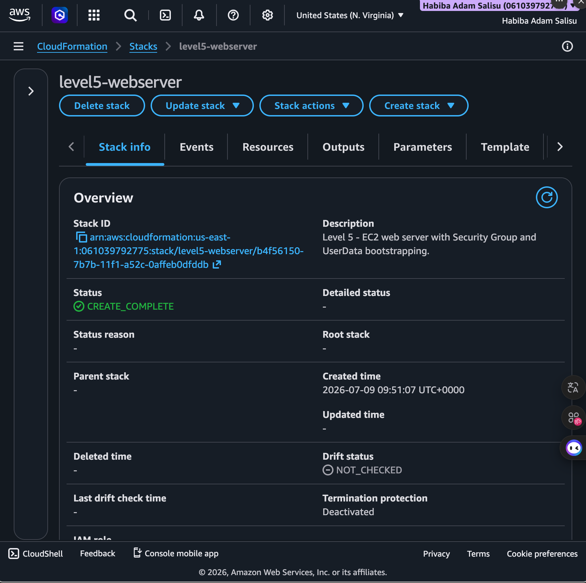

**Observation:**
- The stack was successfully created, and the EC2 instance is running with the expected configuration, with apache installed and serving a default web page. The security group is correctly configured to allow inbound HTTP traffic on port 80.

#### Step 2: Verifying the Deployed Resources

**Screenshot:**

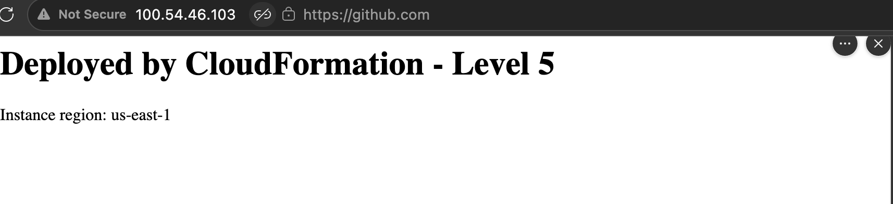

**Observation:**
An EC2 instance was successfully created with the specified parameters. The security group was also created and associated with the instance, allowing the expected inbound traffic.

#### Step 3: Updating the Stack
**Screenshot — Updating Instance Type Parameter:**
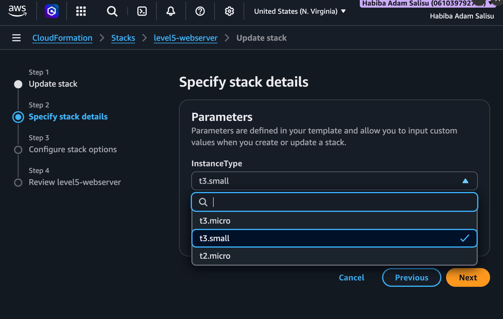

**Screenshot — Stack Update Events:**
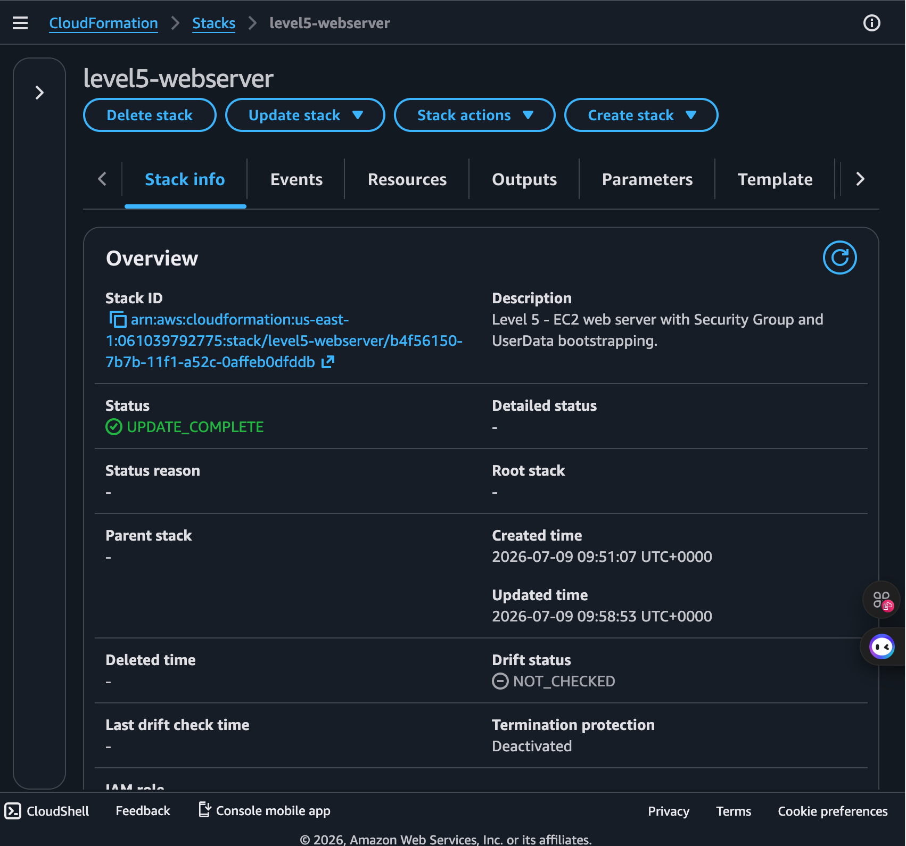

**Screenshot - Output after Update:**
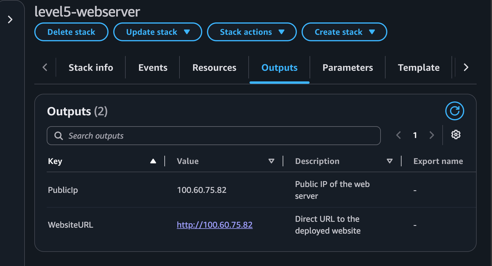

**Observation:**
The stack was successfully updated to change the instance type. The EC2 instance was replaced with a new instance of the specified type, and the public IP address changed accordingly.

### Lessons Learned
If something like the instance type is changed, CloudFormation will replace the resource rather than update it in place, which can lead to downtime if not planned for.

---

## Level 6 — Composition: Nested Stacks

### What This Level Demonstrates
This level demonstrates how to break down complex infrastructure into reusable nested stacks, allowing for better organization and modularity of CloudFormation templates. Nested stacks enable you to manage related resources together and reuse templates across different stacks.

### Template Overview

Unlike Level 5, this level uses three separate template files. The two child templates are uploaded to an S3 bucket first, and the parent template references them by URL.

| Template | Location | Role |
|---|---|---|
| [`root.yaml`](templates/root.yaml) | Deployed directly via console | Parent — orchestrates the two nested stacks and passes outputs between them |
| [`network.yaml`](templates/network.yaml) | Uploaded to S3 | Child — provisions the VPC and public subnet, exports their IDs as outputs |
| [`compute.yaml`](templates/compute.yaml) | Uploaded to S3 | Child — receives VPC and subnet IDs from the network stack, provisions the EC2 instance and security group |

**How they connect:**
1. `network.yaml` is deployed first (via `NetworkStack` resource in the parent) and outputs `VpcId` and `SubnetId`
2. `root.yaml` passes those outputs as parameters into `ComputeStack` using `!GetAtt NetworkStack.Outputs.VpcId`
3. `compute.yaml` receives those values and uses them to wire the EC2 instance into the correct network

**Key resources defined:**
- `network.yaml` — `AWS::EC2::VPC`, `AWS::EC2::Subnet`
- `compute.yaml` — `AWS::EC2::SecurityGroup`, `AWS::EC2::Instance` (with Apache via `UserData`)
- `root.yaml` — `AWS::CloudFormation::Stack` (×2), wiring the two child stacks together

**New CloudFormation features introduced:**
- `AWS::CloudFormation::Stack` — embedding one stack as a resource inside another.
- `!GetAtt StackName.Outputs.OutputKey` — reading a child stack's output in the parent
- `TemplateURL` — referencing templates stored in S3
- `DependsOn` — enforcing that `ComputeStack` waits for `NetworkStack` to finish

### Prediction

Before deploying, I expected:
-   The nested stacks to be created successfully, with the network stack provisioning the VPC and subnet first, followed by the compute stack provisioning the EC2 instance and security group.

### Steps & Observations

#### Step 1: Creating s3 Bucket and Uploading Child Templates

**Screenshot — Creating The S3 Bucket:**

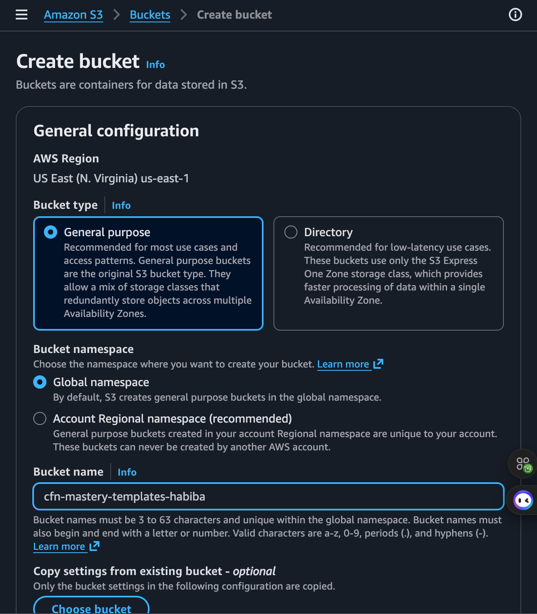

**Screenshot — Uploading Child Templates to S3 And Copying Object URL's Of `network.yaml` and `compute.yaml`:**

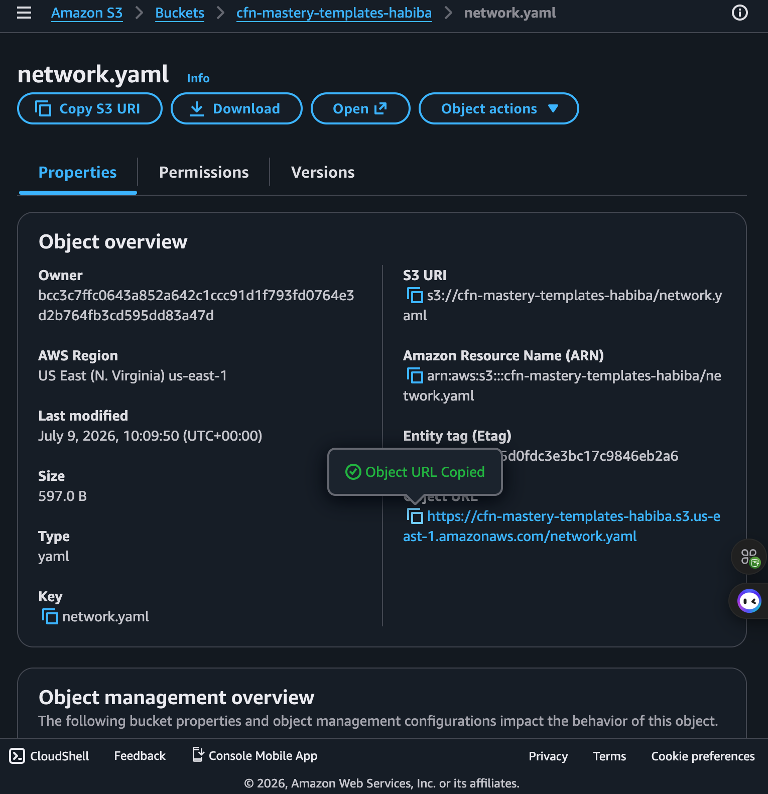

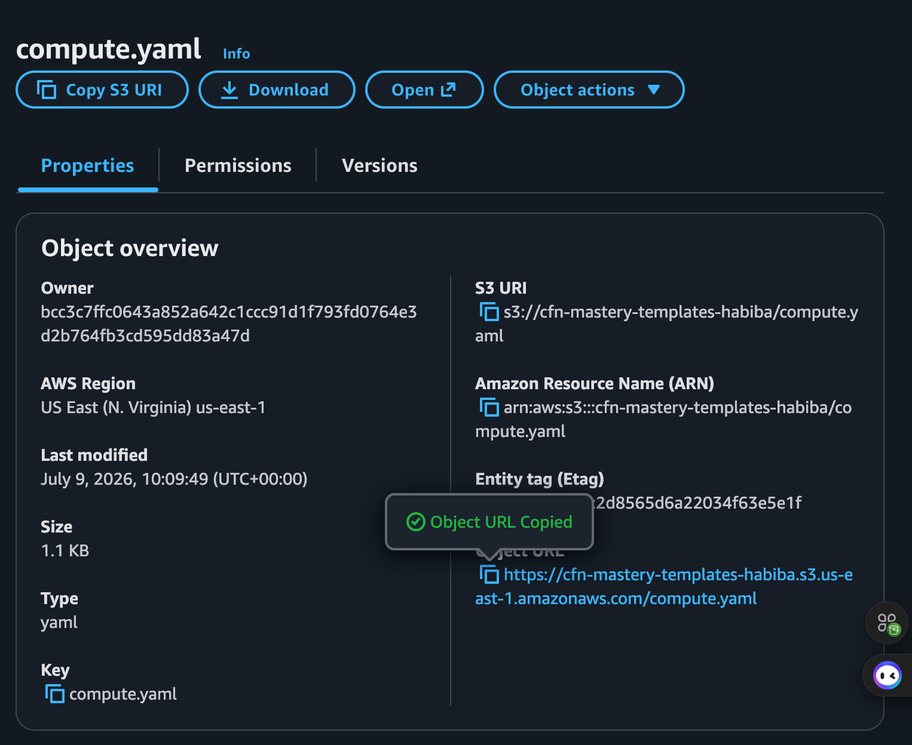

#### Step 2: Writing the Parent Template and Creating the Stack

**Screenshot — Creating The Stack:**
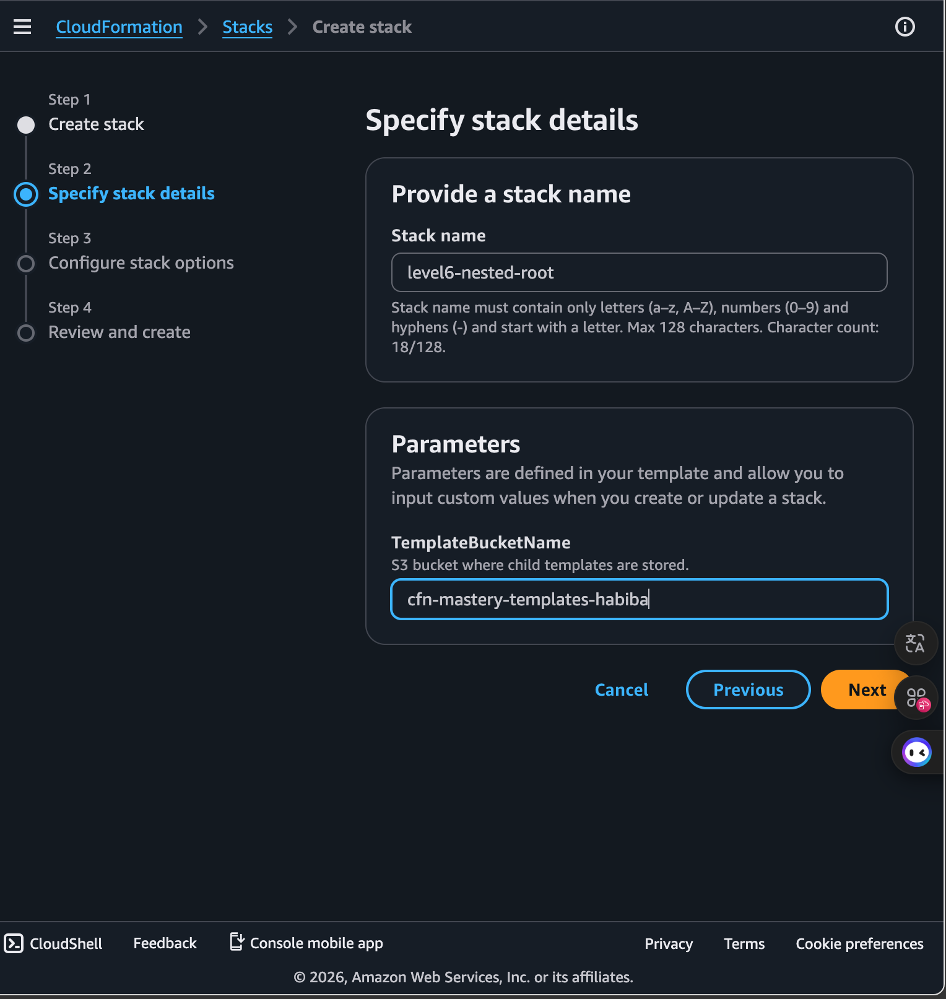

**Screenshot - Observing Stack Dependencies:**

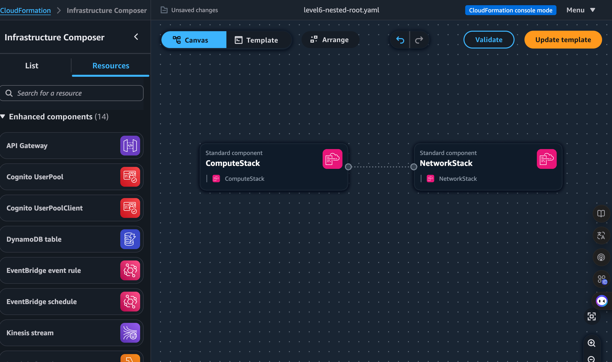

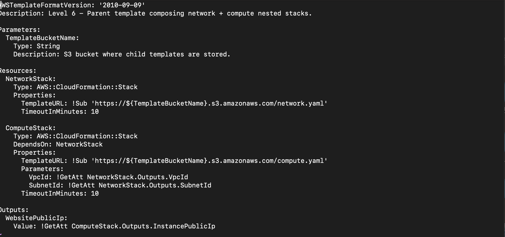

**Observations:**
- The parent stack successfully created the two nested stacks in the correct order, with the compute stack waiting for the network stack to finish.
- The outputs from the network stack were correctly passed to the compute stack, allowing the EC2 instance to be provisioned in the correct VPC and subnet.

### Lessons Learned
- Nested stacks help organize and modularize CloudFormation templates, making complex deployments more manageable.
- Using outputs from one stack as inputs to another allows for dynamic resource configuration and better separation of concerns.
- Nested stacks can simplify updates and deletions by encapsulating related resources together.

---

## Level 7 — Dynamic Intelligence: Custom Resources

### What This Level Demonstrates
This level demonstrates how to extend CloudFormation's capabilities by creating custom resources that can execute arbitrary logic during stack operations. Custom resources allow you to perform actions that are not natively supported by CloudFormation, such as invoking AWS Lambda functions or making API calls to external services.

For this level, I created a custom resource that invokes a Lambda function during stack creation, update, and deletion. The Lambda function performs specific logic and returns a response to CloudFormation, allowing the stack operation to proceed or fail based on the outcome of the Lambda execution.

### Template Overview

> Template file: [`custom_resource.yaml`](templates/custom_resource.yaml)

**Key resources defined:**
- **Custom Resource Lambda Function:** A Lambda function that handles the lifecycle events (Create, Update, Delete) of the custom resource.
- **Custom Resource:** A resource that triggers the Lambda function during stack operations, allowing for custom logic to be executed.

### Prediction

Before deploying, I expected:
- The custom resource to invoke the Lambda function during stack creation, update, and deletion.
- The Lambda function to perform the specified logic and return a response to CloudFormation, allowing the stack to proceed with the operation.
- Any errors in the Lambda function would cause the stack operation to fail, triggering a rollback to maintain infrastructure consistency.

### Steps & Observations

#### Step 1: Creating the Stack And Observing Stack Results

**Screenshot — Stack Events:**

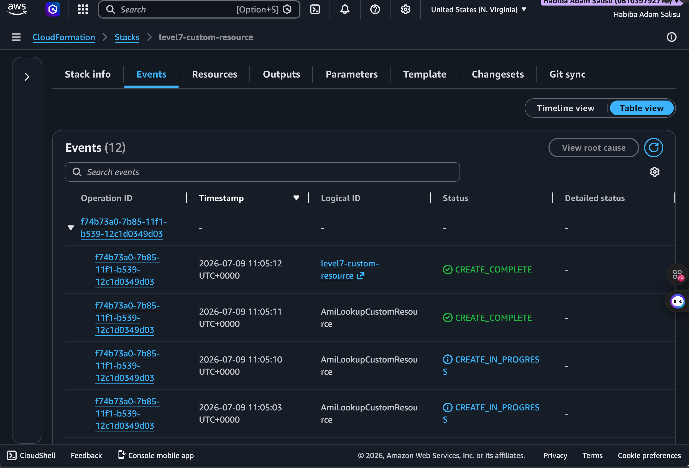

#### Step 2: Verifying the Deployed Resources

**Screenshot:**

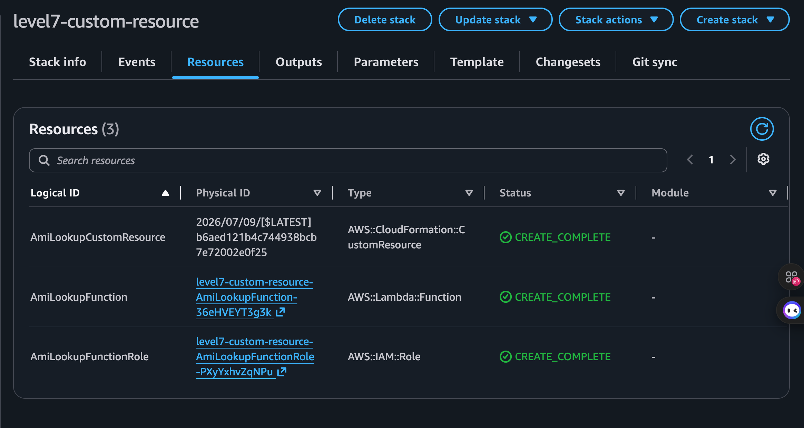

#### Step 3 - Checking The Outputs

**Screenshot:**

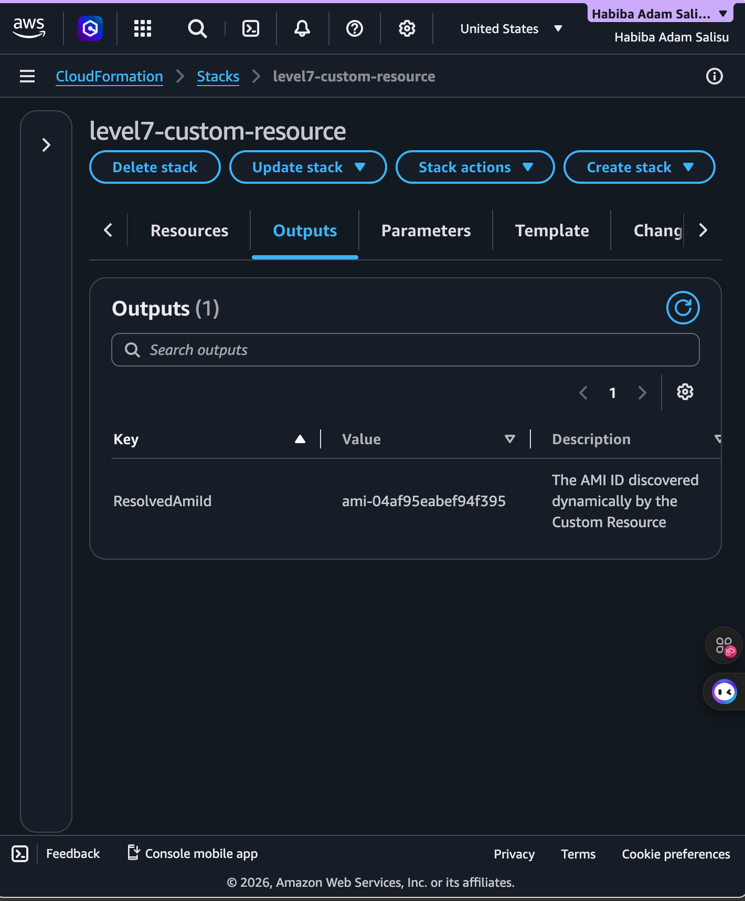

### Lessons Learned
- Custom resources provide a powerful way to extend CloudFormation's capabilities, allowing for dynamic and complex operations that are not natively supported.

---

## Overall Reflection

### What I Would Explore Next

---

## Conclusion

--- 

## References

- [AWS CloudFormation Documentation](https://docs.aws.amazon.com/cloudformation/)
- [AWS CloudFormation Template Reference](https://docs.aws.amazon.com/AWSCloudFormation/latest/UserGuide/template-reference.html)
- [AWS Resource and Property Types Reference](https://docs.aws.amazon.com/AWSCloudFormation/latest/UserGuide/aws-template-resource-type-ref.html)
- [CloudFormation Best Practices](https://docs.aws.amazon.com/AWSCloudFormation/latest/UserGuide/best-practices.html)
