# Docker Hub, CI/CD & Security Automation — Beginner Lab Documentation


## Overview

This documentation records a hands-on beginner lab designed to simulate the way real-world DevSecOps teams work with containers and registries. Rather than treating Docker Hub as a black box, each phase breaks down the mechanics of pulling, building, tagging, pushing, and automating images, while keeping security visible at every step.

By completing these phases, I developed a concrete understanding of:

- How to authenticate with Docker Hub using access tokens instead of passwords
- How to build a minimal, production-grade Flask application and containerise it securely
- How layer caching, non-root users, and `.dockerignore` reduce risk at build time
- How to push, pull, and share images via a public registry
- How GitHub Actions automates the entire workflow and gates pushes behind a Trivy vulnerability scan


## The Sample Application

The application built intentionally simple. Its purpose is to demonstrate containerisation and CI/CD concepts, not complex application logic.

**`app.py`** —> starts a Flask web server on port 5000 and exposes two routes:
- `/` —> renders an HTML greeting page, injecting a configurable node name via a Jinja2 template
- `/health` —> returns a JSON response with status, node name, and UTC timestamp; used by Docker's `HEALTHCHECK` and the pipeline's smoke test

**`templates/index.html`** —> a minimal HTML page that displays the greeting injected by Flask.

**`requirements.txt`** —> pins the Flask version for reproducible builds across all environments.

**`dockerfile`** —> builds from `python:3.11-slim`, creates a non-root user, optimises layer caching by copying `requirements.txt` before application code, and declares a `HEALTHCHECK`.

**`.dockerignore`** —> prevents development artefacts, `.git`, `.env` files, and Markdown from entering the image.


## Initial Step Taken - Generating a Docker Hub Access Token

The objective of this step is to generate a scoped access token for Docker Hub to authenticate without exposing an account password — following the principle of least privilege.

**What was done:**
- Logged in to hub.docker.com
- Navigated to: Avatar → Account Settings → Security → New Access Token
- Named the token `lab-token` and selected **Read & Write** permissions
- Copied the generated token immediately.


**Security Implications:**
- Access tokens can be scoped and revoked independently of the account password
- Using a token instead of a password means a leaked credential cannot be used to modify account settings or generate further tokens

---


## Phase 0: Pull and Inspect a Public Container

In this phase, I acted as an image consumer — pulling an existing public image from Docker Hub, running it, inspecting it, and observing how Docker manages layers and containers.

#### Key Concepts Demonstrated

- `docker pull` and image layer downloading
- Running a detached container with port mapping
- Inspecting running containers and logs
- Cleaning up with `docker rm -f`

---
### Steps & Observations

#### Step 1: Pulling the Nginx Alpine Image

```bash
docker pull nginx:alpine
```

#### Step 2: Running the Container


```bash
docker run -d -p 8080:80 --name my-nginx nginx:alpine
```


#### Step 3: Inspect Running Containers and Logs

```bash
docker ps
docker logs my-nginx
```

**Screenshot:**

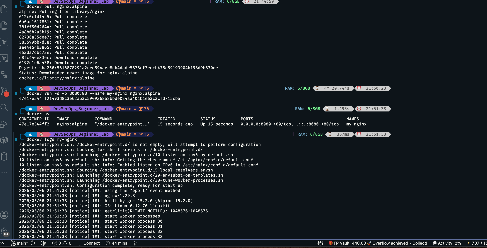


#### Step 4: Confirming On Browser on Port 8080


```bash
# Opening http://localhost:8080 in browser
```

**Screenshot:**

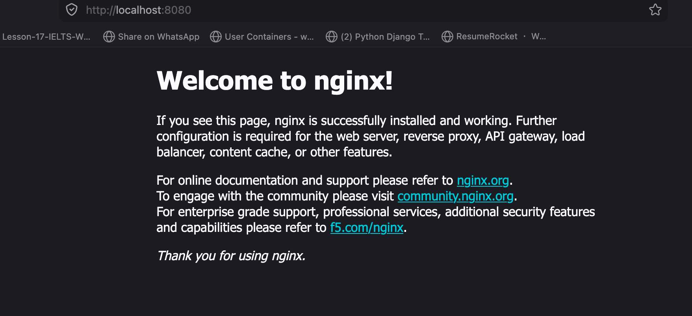

**Overall Observation:**
- An image built and published by another person was pulled and downloaded.
- A container was derived/created from the pulled image.
- Port mapping made the image accessible from the browser.

---


## Phase 1: Build, Push, Pull & Share Your Own Image


In this phase, I transitioned from image consumer to image creator — building a Flask web application, containerising it securely, pushing it to Docker Hub, pulling it back to verify, and sharing it with others.

---

### Step 1: Creating the Web Application

#### Key Concepts Demonstrated

- Flask routing and JSON health endpoints
- Environment variable injection for configurable behaviour
- Jinja2 HTML templating

#### Write `app.py` and `templates/index.html`

> Check [`app.py`](app.py) and [`templates/index.html`](templates/index.html) for the full content.


### Step 2: Writing A Secure Dockerfile

#### Key Concepts Demonstrated

- `python:3.13-slim` as a minimal base image, the base image was initially set to `python:3.11-slim`
- Non-root user creation with `groupadd` / `useradd`
- Layer caching optimisation by copying `requirements.txt` first
- `HEALTHCHECK` instruction for container liveness monitoring
- `.dockerignore` to exclude unwanted files from the build context

> Check [`dockerfile`](dockerfile) for the full content.


### Step 3: Building and Testing Locally

#### Key Concepts Demonstrated

- `docker build` and the build context
- Running and verifying a container locally before pushing
- Testing both the home page and the `/health` endpoint

#### Step 3.1: Building the Image

```bash
docker build -t my-web-app .
```

#### Step 3.2: Running and Testing Locally

```bash
docker run -d -p 5001:5000 --name webapp-test my-web-app
```
**Screenshot:**

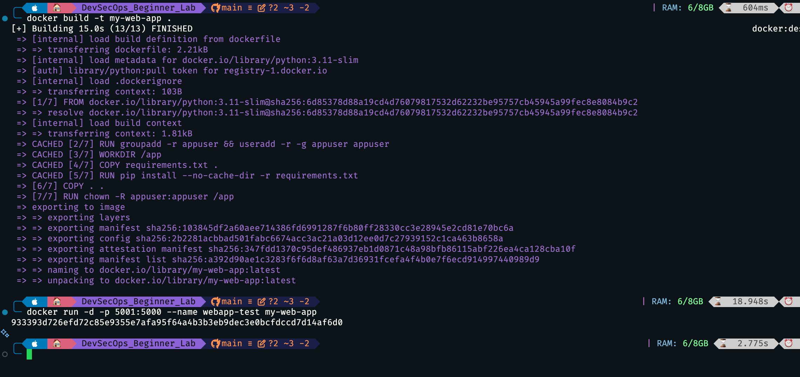

```
NB: Instead of port 5000, the port mapping was changed to 5001 because an important running process was utilizing port 5000.
```

**Screenshot:**

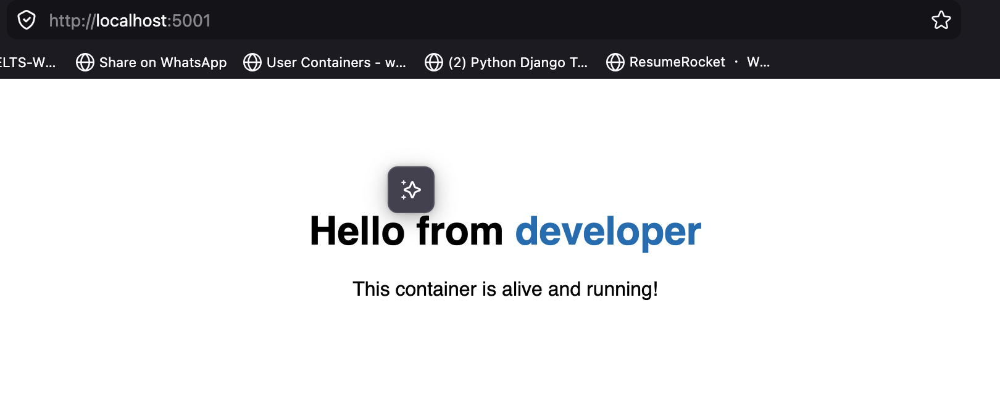

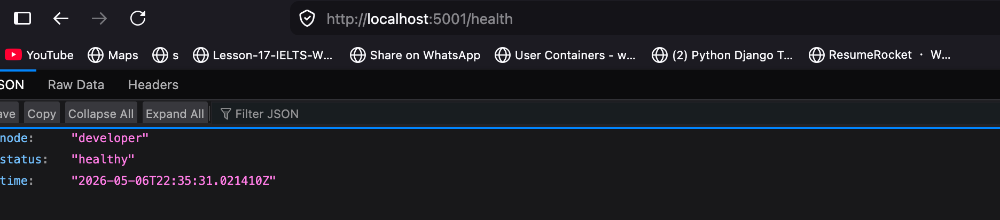
---

#### Step 3.3: Stopping and Removing The Test Container

**Command:**
```bash
docker rm -f webapp-test
```

### Step 4: Pushing to Docker Hub

#### Key Concepts Demonstrated

- Authenticating with Docker Hub using an access token
- Tagging an image with a registry path and personal identifier
- Uploading image layers to the registry

#### Step 4.1:  Logging In to Docker Hub

**Command:**
```bash
docker login -u your-dockerhub-username
```

#### Step 4.2: Tagging and Pushing the Image

**Commands:**
```bash
docker tag my-web-app your-dockerhub-username/my-web-app:v1.0.0-john
docker push your-dockerhub-username/my-web-app:v1.0.0-john
```

**Screenshot:**

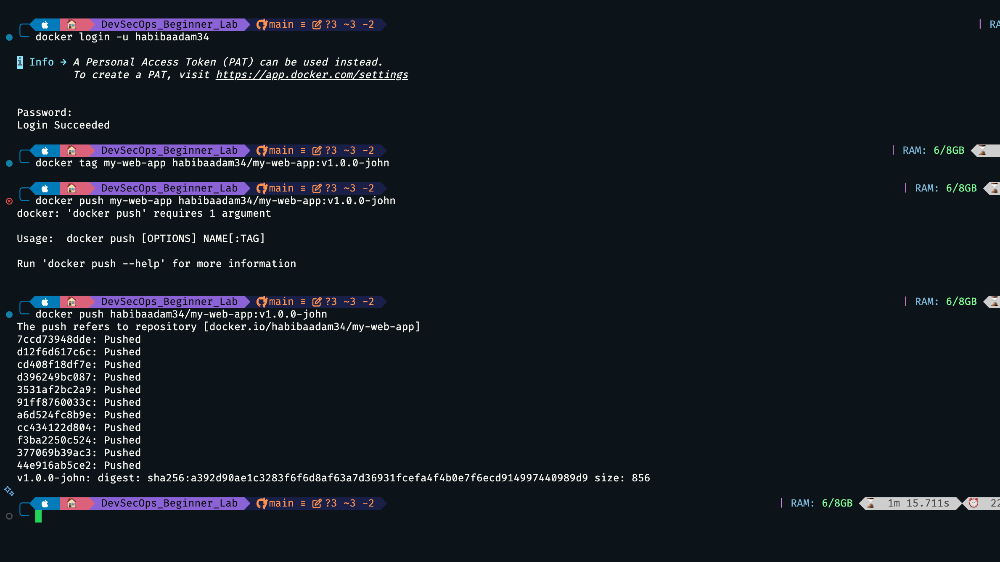

---

### Step 5: Pulling Own Image

#### Key Concepts Demonstrated

- Simulating a fresh environment by removing the local image
- Pulling from Docker Hub to verify the push succeeded

#### Step 5.1:  Removing the Local Image and Pulling from Registry

**Commands:**
```bash
docker rmi your-dockerhub-username/my-web-app:v1.0.0-john
docker pull your-dockerhub-username/my-web-app:v1.0.0-john
docker run -d -p 5000:5000 --name pulled-app your-dockerhub-username/my-web-app:v1.0.0-john
```

**Screenshot:**

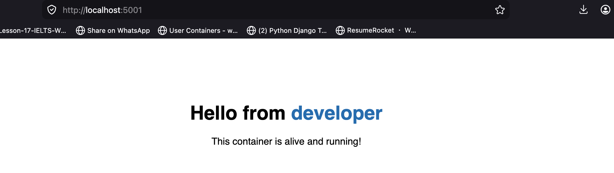

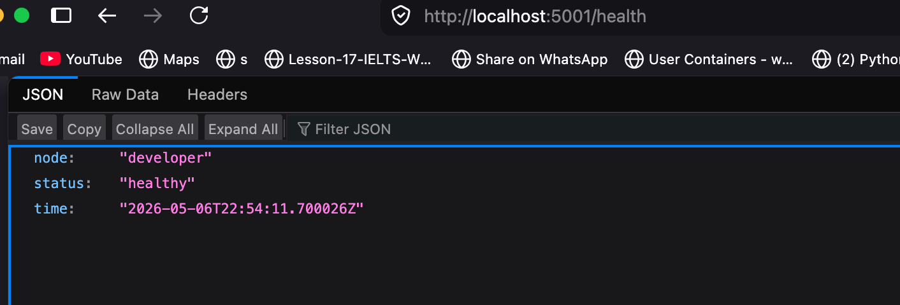


### Step 6: Sharing with Others

```
The pushed image can be shared with others, in the format dockerhub-username/my-web-app:v1.0.0-habi, and the commands mentioned in Step 5.1 can be run to access the image from the registry
```


## Overall Observations After Phase 1

**Key things observed:**
- The `python:3.11-slim` base image produces a significantly smaller image than a full Python image, directly reducing the attack surface.
- Copying `requirements.txt` before the application code means the `pip install` layer is only re-run when dependencies actually change.
- The `/health` endpoint proved immediately useful as a machine-readable liveness check, separate from the user-facing home page.
- Pulling the image from Docker Hub to verify the push is a simple but important habit — it confirms what was pushed is what runs, not just what exists locally

**Security/System Implications:**
- Using an access token rather than an account password for `docker login` limits the blast radius of a leaked credential. The token can be revoked without changing the account password
- A public repository means anyone can pull and run the image; sensitive data must never be baked into the image layers, which is enforced by `.dockerignore` and the absence of `.env` files in the build context
- The non-root `USER` instruction and the `HEALTHCHECK` instruction are both security and reliability hardening measures that cost nothing to add but meaningfully reduce risk in production


---

## Phase 2: Automate with a DevSecOps Pipeline

In this phase, I built a GitHub Actions CI/CD workflow that automatically builds, vulnerability-scans, and pushes the image on every push to `main` — ensuring no unscanned image ever reaches the registry.

Due to the structure of this repository because it contains other project folders, the `.github/workflows` exists at the root, and the project files are placed in `DevSecOps_Beginner_Lab`.

### Key Concepts Demonstrated

- GitHub Actions workflow syntax and triggers with `paths` filters.
- Storing credentials as encrypted GitHub secrets.
- `docker/build-push-action` for building and loading images.
- Trivy (`aquasecurity/trivy-action`) for scanning before pushing.
- Conditional steps with `if: success()`.
- Smoke testing a running container inside the pipeline

---

### Step 1:  Adding Secrets to GitHub

As noted in the overview, this project lives inside an existing repository (`PR_DevSecOps`) under the `DevSecOps_Beginner_Lab/` folder. No new repository was created — the workflow file was placed at the root `.github/workflows/` and the `paths` filter in the trigger ensures it only runs when files inside `DevSecOps_Beginner_Lab/` change.

The only setup required before triggering the pipeline was adding two encrypted secrets to the repository so the workflow could authenticate with Docker Hub.

**What was done:**
- Navigated to the repository on GitHub → Settings → Secrets and variables → Actions
- Added `DOCKERHUB_USERNAME` — the Docker Hub account username
- Added `DOCKERHUB_TOKEN` — the access token generated in the initial step, pasted directly from where it had been copied

**Security/System Implications:**
- Secrets are encrypted at rest and are never exposed in workflow logs — GitHub masks them if they appear in output
- Using a scoped access token as `DOCKERHUB_TOKEN` rather than the account password means the credential can be revoked without affecting the Docker Hub account itself

---

### Part 3: The Workflow File

#### Step 1: Review `docker-build-push.yml`

> Check [`docker-build-push.yml`](../.github/workflows/docker-build-push.yml) for the full content and a detailed explanation

```
NB: If this project was done on a repository on it's own, there would be no need to include the `paths` as triggers for both the push and pull requests
```

### Part 4:  Trigger the Pipeline

#### Step 1: Push a Change and Watch the Actions Tab

**Screenshot:**

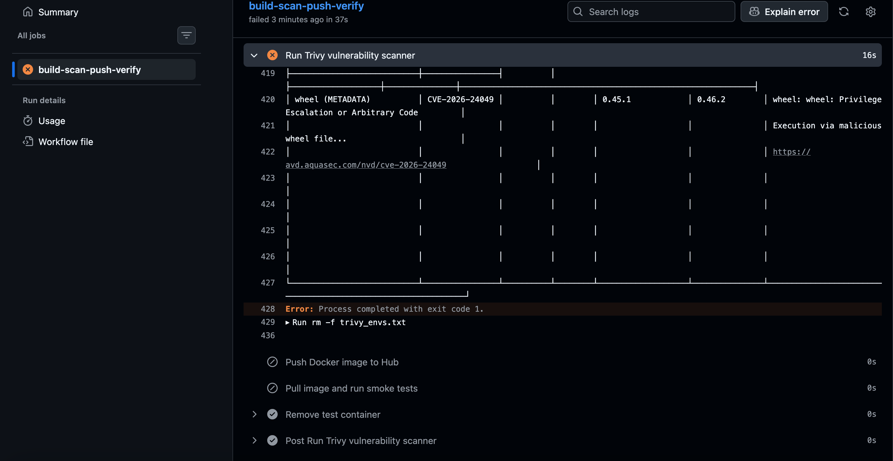

**Observation:**
- After the first commit and push, the results of trigggering the job ended in a failure.
- The first cause of the failure was the version of trivy stated in the workflow(version 20)
- The second cause of failure was from a successful trivy scan, hinting at outdated dependencies and base image.

**Fixes:**
- Updating the yml file to use an up to date version of trivy- version 36
- Using `python3.13-slim` as the base image in the dockerfile and updating requirements.txt to use latest version of flask which is `flask==3.1.1`.

---

#### Step 3:  Successful Push Test

**Screenshot:**

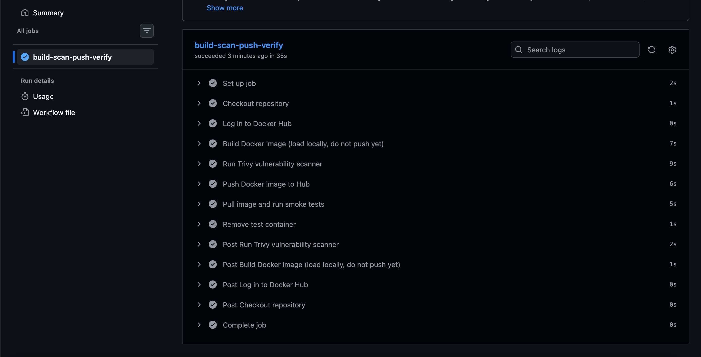

---

### Part 5: Pull the Automatically Built Image

#### Step 1: Pull the Pipeline-Built Image Locally

**Command:**
```bash
docker pull your-dockerhub-username/my-web-app:v1.0.0-habi
```

**Screenshot:**

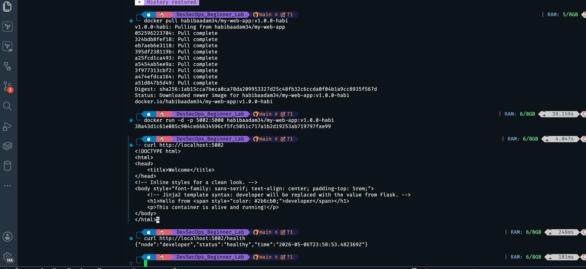


**Observation:**
- The pulled image from the ci system behaves the same way as the manual build.

### Clean Up

**Commands used to remove all lab resources:**
```bash
docker rm -f $(docker ps -aq) 2>/dev/null

docker rmi my-web-app your-dockerhub-username/my-web-app:v1.0.0-john nginx:alpine 2>/dev/null

```


## Reflection

1. The experience of the first pipleline was very valuable. Having to diagnose two seperate causes(a deprecated action version nd a real CVE in the base image) and fixing the, before a push could succeed is the exactly the kind of iteration that happens on real teams. It reframed the failure not as a mistake but as the pipeline doing its job correctly.
2. The most concrete learning from this lab was seeing security as something built into the workflow rather than added at the end. The Trivy scan sitting between the build and the push means a vulnerable image physically cannot reach the registry. It is not a policy or a reminder, it is a gate. That distinction did not fully register until the pipeline failed on the first run because of an outdated base image, which made the point more effectively than any explanation could.

## Conclusion
This lab covered the full container lifecycle from a DevSecOps perspective: pulling a public image to understand how registries work, building and hardening a custom image from scratch, publishing it to Docker Hub, and then automating the entire process with a GitHub Actions pipeline that enforces a security scan before any image can be pushed. Each phase built directly on the previous one, and the decisions made early — choosing a slim base image, running as a non-root user, excluding files with .dockerignore — had visible consequences later when Trivy scanned the final image. The result is a workflow that reflects how production teams operate: credentials stored as secrets, builds triggered automatically on code changes, and vulnerability scanning embedded in the pipeline rather than treated as an optional step.

---


## References

- [Docker Official Documentation](https://docs.docker.com/)
- [Docker Hub](https://hub.docker.com/)
- [GitHub Actions Documentation](https://docs.github.com/en/actions)
- [Trivy — Aqua Security](https://github.com/aquasecurity/trivy)
- [OWASP Docker Security Cheat Sheet](https://cheatsheetseries.owasp.org/cheatsheets/Docker_Security_Cheat_Sheet.html)
- [Flask Documentation](https://flask.palletsprojects.com/)
- [Node.js Docker Best Practices](https://github.com/nodejs/docker-node/blob/main/docs/BestPractices.md)
