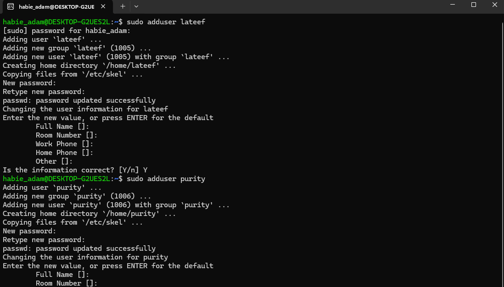
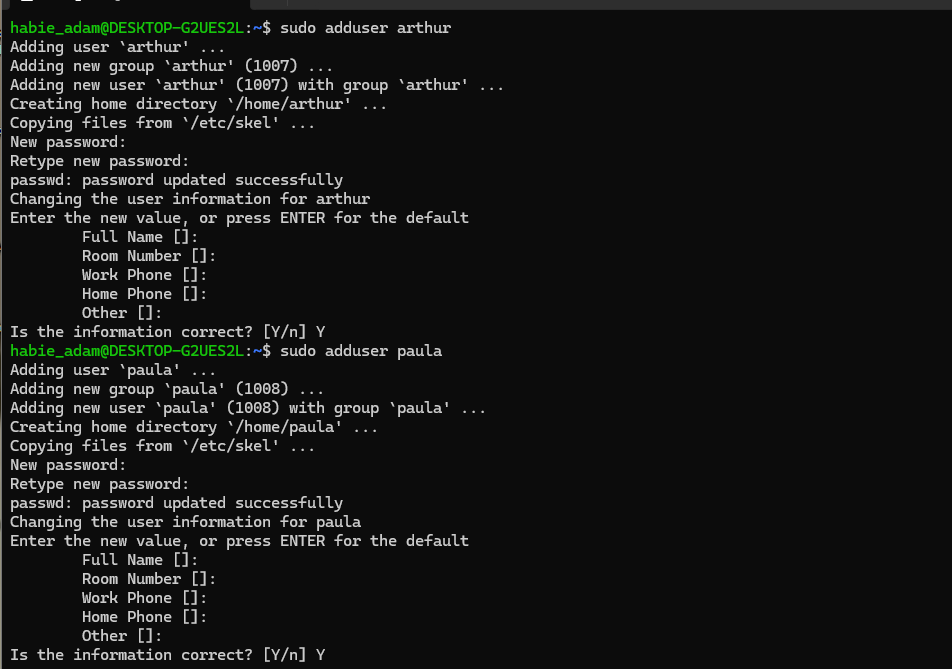
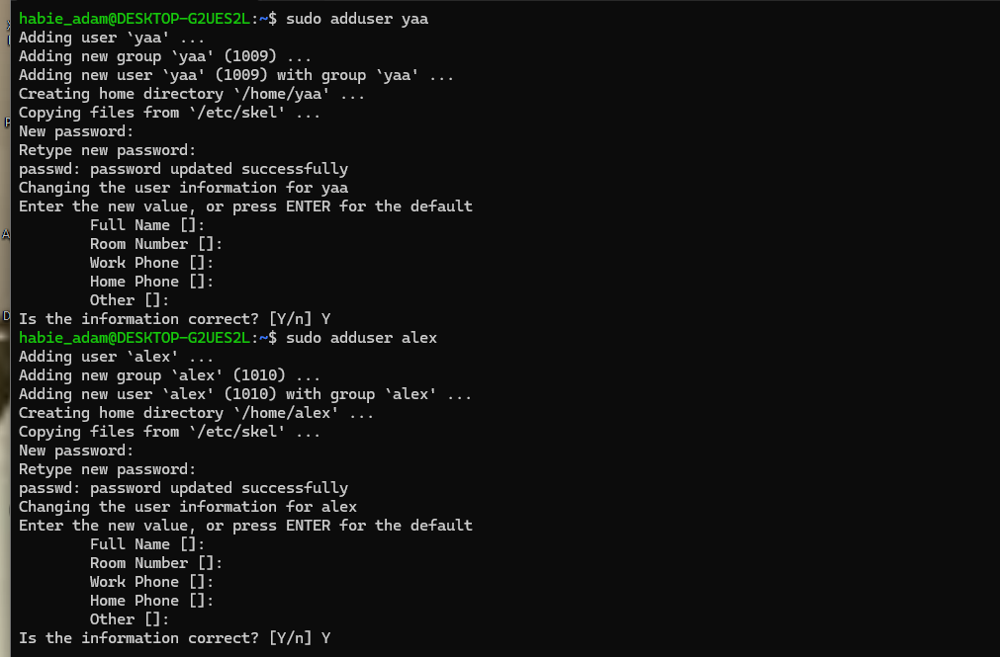
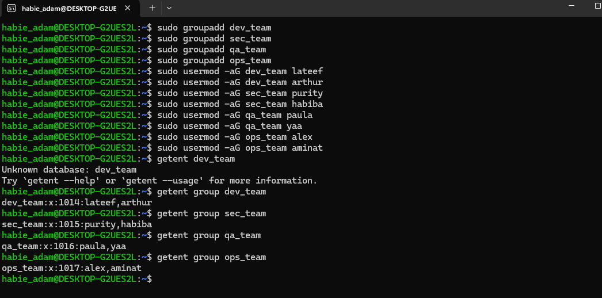
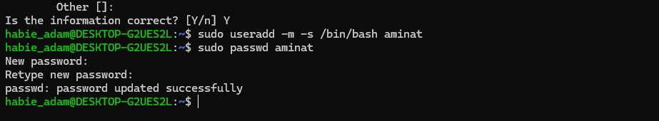
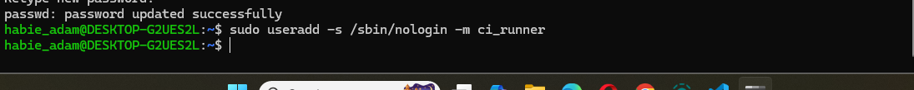
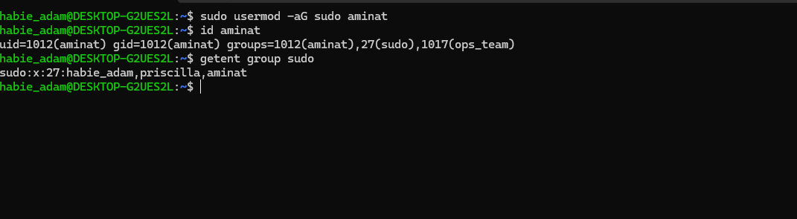
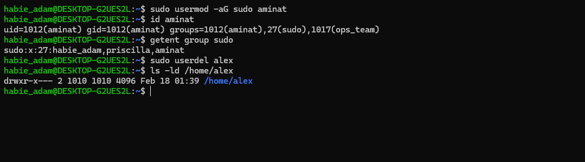

# DevSecOps Linux Hands-On Assignment Documentation

## Overview

This documentation provides a complete walkthrough of the Linux & DevSecOps assignment scenarios. Each section includes screenshots of executed, terminal output evidence, observation, and security considerations.

### Scenario 1 - Password State Investigation & Remediation
<p>
During a routine security audit, the Security Director asks:

**Show me how you identify users on this system who do not have passwords set, and then demonstrate how you would remediate one."**

The objective of this scenario is to identify users on system who do not have passwords set,and to demonstrate remediation of the said scenario.

Below are the steps taken to achieve the objective.
</p>

#### Step 1 - Creating A User With No Password


---

#### Step 2 - Identifying Users Without A Password


#### Step 3 - Remediation (Setting A Password)


**State Before Setting A Password for `audit_test`**
     
**State After Setting A Password for `audit_test`**
      

---

**What was done:**

- A new user named `audit_test` was created using:
  ```
  sudo useradd -m -s /bin/bash audit_test
  ```
- Verified the existence of the account by checking the `/etc/passwd` file.

- Checked the system location `etc/shadow` to find password states.
- Set a password for `audit_test` by using:
   ```
   sudo passwd audit_test
   ```
- Confirmed the state of the password by rechecking the `etc/shadow` file.

**Reasons Why It was Done:**
- The `-m` flag in the sudo useradd command ensures a home directory is created for `audit_test`
- The `-s` flag followed by the `/bin/bash` sets a default bash shell for the newly created user.
- To check for the initial password state of `audit_test`, I checked the `etc/shadow` file.
- A password was set for `audit_test` using the `sudo passwd audit_test`.

**Observations Made:**
- After checking the `etc/passwd` file where all users exist:
   - User `audit_test` was assigned UID(userId) 1004
   - User `audit_test` was assigned GID(groupId) 1004
   - User `audit_test` was given a home directory and also a default bash shell.
- I observed that `audit_test` had no password because after checking the `etc/shadow` file, there was a `!`, which represents a locked account or an account with no way to be authenticated or identified.
- After setting the password using the aforementioned command, and crosschecking etc/shadow, the `!` was replaced by hashed set of characters, indicating that a password has been set for `audit_test`.

**Security/System Implications**
- Users without passwords pose a security threat as any process or service running as audit_test could be accessed without authentication
- Users without a password can exist on the system but cannot log in interactively until a password is set.

---

### Non Privileged User Attempt At Accessing `etc/shadow` file.

  - A non privileged user is a user who does not belong to the `sudoers` group. Such users cannot temporarily use the `sudo` command to elevate their privileges.
  - I logged in as `mark`, a non privileged user and attempted to access/view the `/etc/shadow` file.
  - I received feedback confirming that the user `mark` could not view the systems location for storing password states because `mark` is a non privileged user.

  #### Conclusion
  By attempting to access `/etc/shadow` as `mark`, a non-privileged user, I confirmed that:

 - Access Control Works as Intended - The `/etc/shadow` file is protected with `600` permissions (readable only by root), preventing unauthorized users from viewing sensitive password hashes.
- Privilege Separation is Enforced - Even legitimate users without sudo privileges cannot access critical system files that contain authentication data, reducing the attack surface.

---

### Scenario 2 :  DevSecOps User & Department Access
<p>
As a DevSecOps Engineer responsible for onboarding new staff onto a Linux server used for application development, security monitoring, QA and CI/CD Operations, The objective of this scenario is to implement department based access through group management, least privilege principle via restricted permissions, and audit traceability through proper user and group configurations.

Below are the detailed steps taken to achieve the objectives.
</p>

---

#### Step 1 - Creating Users For Newly Onboarded Staff (lateef, purity, arthur, paula, yaa, alex, habiba, and aminat)







---

#### Step 2 - Creating Departments(Groups) and Adding Staff To Respective Departments.



#### Step 3 - Ensuring One User `aminat` is created without a password and setting it later.


---

#### Step 4 - Creation Of service account named `ci_runner` with a non login shell



#### Step 5 - Granting Sudo Access To One User from `ops_team`, which is `alex`


#### Step 6 - Deleting one user account whiles preserving the home directory



---

**What was done:**
- All staff/users except `aminat` were created with this command

   ```
   sudo adduser <staff_name>
   ```
- Groups representing the departments -> `dev_team`,
`sec_team`, `qa_team`, `ops_team` were created using:

    ```
    sudo groupadd <group_name>
    ```
- Users/staff were added to their respective teams using:

   ```
   sudo usermod -aG <group_name> <user_name>
   ```
   and verified group membership using
   ```
   getent group <group_name>
   ```
- A user `aminat` was created without a password initially with:
   ```
   sudo useradd -m -s /bin/bash <user_name>
   ```
   and later set with :
   ```
   sudo passwd <username>
   ```
- A service user namd `ci_runner` with a non login shell was created using:

  ```
  sudo useradd -s /sbin/nologin -m <user_name>
  ```
- Sudo access was granted to a user from the `ops_team`, `aminat` using:

  ```
  sudo usermod -aG sudo <user_name>
  ```
- A user's account `alex` was deleted whiles preserving their home directory using:
  ```
  sudo userdel <user_name>
  ```

---

**Why It Was Done**