# DevSecOps Linux Hands-On Assignment 2 Documentation

## Overview

This documentation provides a complete walkthrough of Linux file security, permissions, and forensic scenarios. Each section includes executed commands, terminal output evidence, observations, and security implication.

## Scenario 1 – Shared Document Deletion Incident(Outlined Steps)

<strong>Context:</strong> An intern accidentally deleted a shared design document. The objective is to reproduce the incident and implement controls to prevent recurrence.

### Part A – Multi-User Simulation(Outlined Steps)

#### Step 1 - Creating Users (intern_a, dev_user, ops_user)
#### Step 2 - Creating Group and Assigning Users
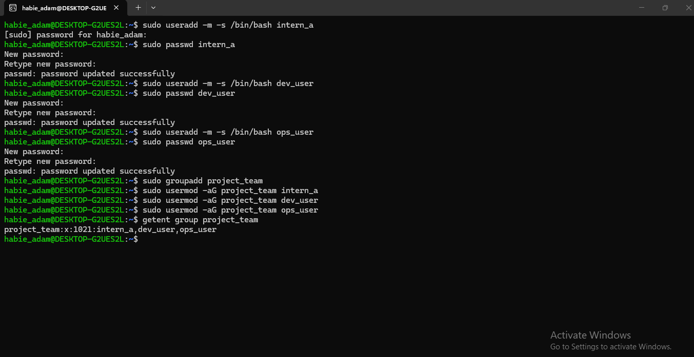

### Part B – Reproducing the Incident

#### Step 1 - Creating Shared Directory and File
#### Step 2 - Logging in as intern_a and Deleting the File

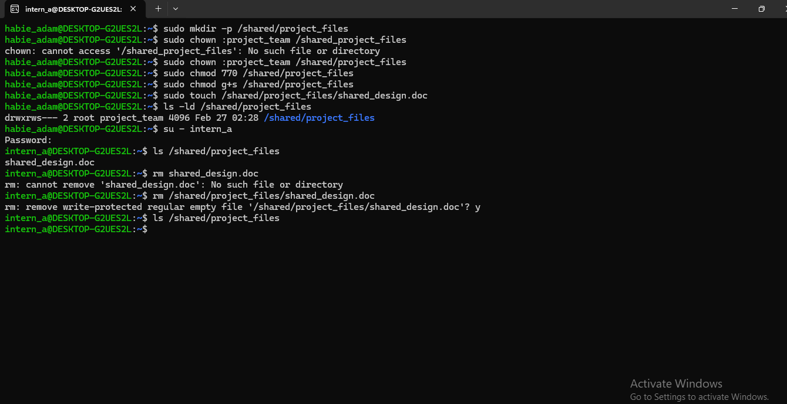

### Part C – Preventing Recurrence (Outlined Steps)

#### Step 1 - Recreating the File
#### Step 2 - Applying Immutability Protection (chattr +i)
#### Step 3 - Testing Deletion as intern_a

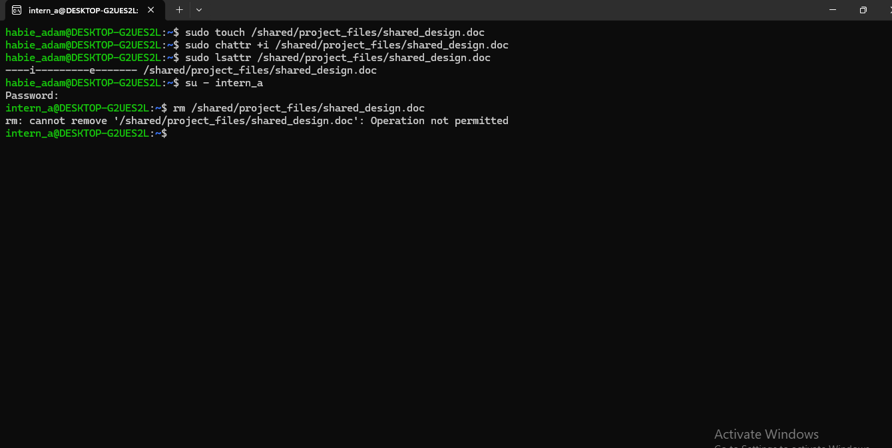

**What was done:**

-
-
-

**Explanations & Observations:**

-
-
-
-

## Scenario 2 – Log Overwrite Incident

<strong>Context:</strong> Application logs were overwritten, destroying forensic history. The objective is to simulate, prevent, and backup logs with proper metadata preservation.

#### Step 1 - Creating logs/app.log with 100+ Lines

#### Step 2 - Simulating Accidental Overwrite And Seeing Line Counts
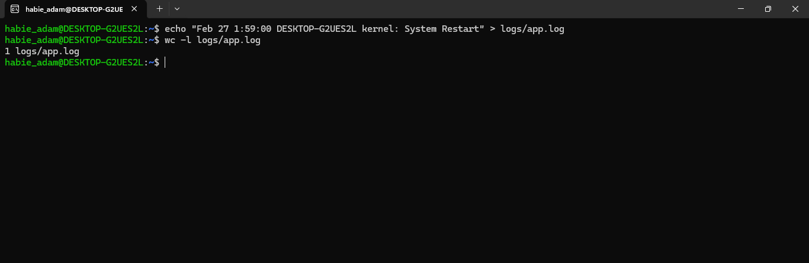

#### Step 3 - Applying Overwrite Prevention Mechanism And Creating Backup
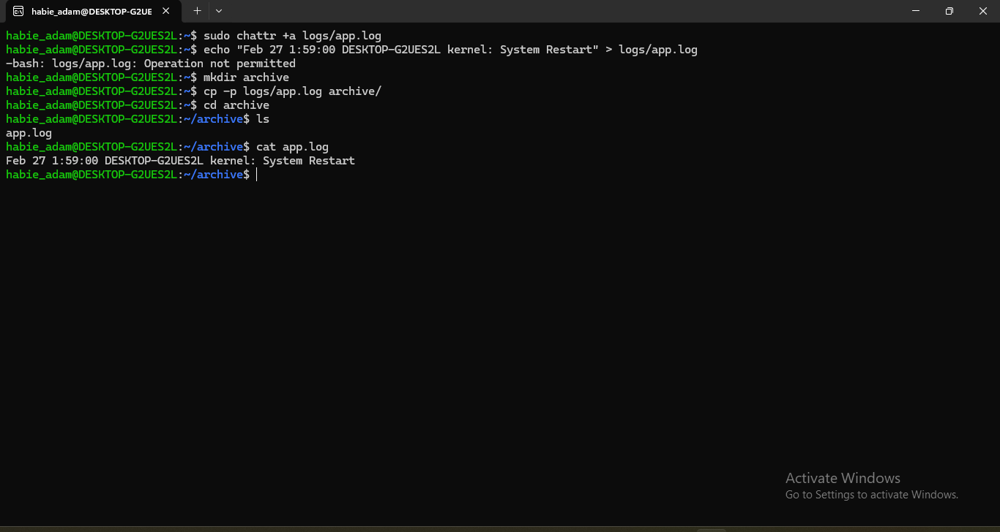

---

**What was done:**

-
-
-

**Explanations & Observations:**

-
-
-
-

## Scenario 3 – Permission & Ownership Drift

<strong>Context:</strong> A deployment script copied incorrect data due to relative path usage. The objective is to reproduce and fix the issue using absolute paths.

#### Step 1 - Creating Files with Varying Permissions
#### Step 2 - Changing Ownership and Groups (chown, chgrp)
#### Step 3 - Copying Files WITHOUT Preservation Flags
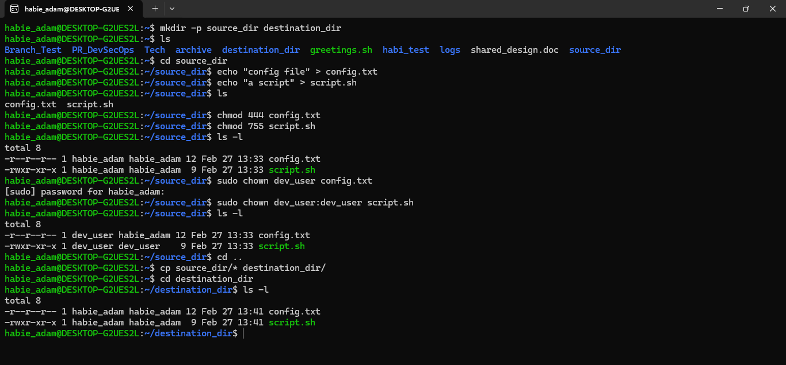

#### Step 4 - Copying Files WITH Preservation Flags (cp -p)
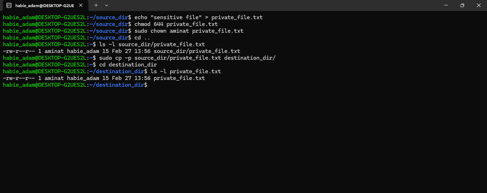

#### Step 5 - Copying Files & Folders WITH Preservation Flags (cp -r)
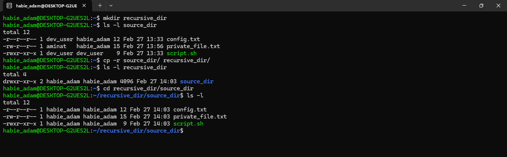

---

**What was done:**

-

**Explanations & Observations:**

-
-
-
-

---

## Scenario 4 – Relative Path Deployment Failure

<strong>Context:</strong> A deployment script copied incorrect data due to relative path usage. The objective is to reproduce and fix the issue using absolute paths.

- Incoming Step Evaluation Soon

---

## Scenario 5 – Monitoring Failure After Log Cleanup

#### Step 1 - Creating the Original Log File
#### Step 2 - Creating a Hard Link
#### Step 3 - Creating a Symbolic Link
#### Step 4 - Removing the Original File
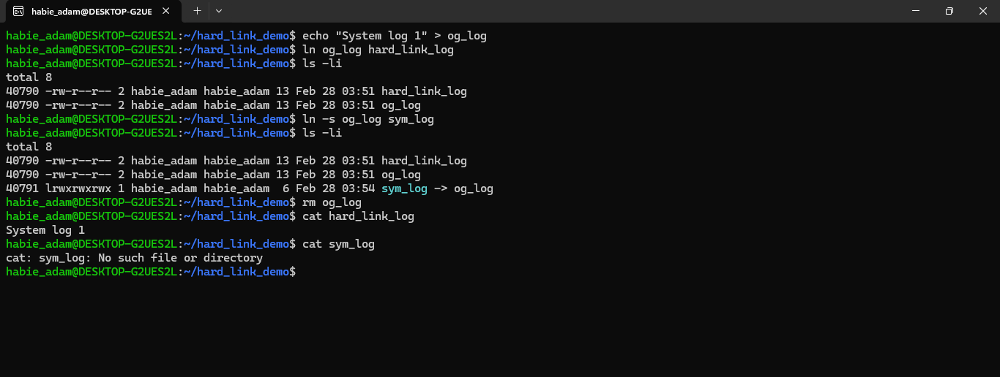

**What was done:**

-

**Explanations & Observations:**

-
-
-
-

---

## Scenario 6 – Sensitive Data Exposure Hunt

<strong>Context:</strong> Security team suspects secrets are hidden in logs and config files. The objective is to scan for sensitive data using grep techniques and proper output redirection.

---

#### Step 1 - Simulating Logs and Using Recursive Scanning (grep -r)

#### Step 2 - Using Multiple Expressions (grep -e)

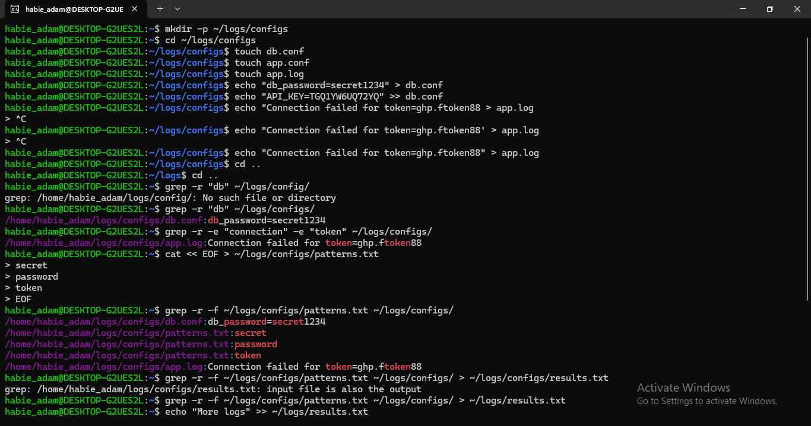

#### Step 3 - Using Pattern File (grep -f)
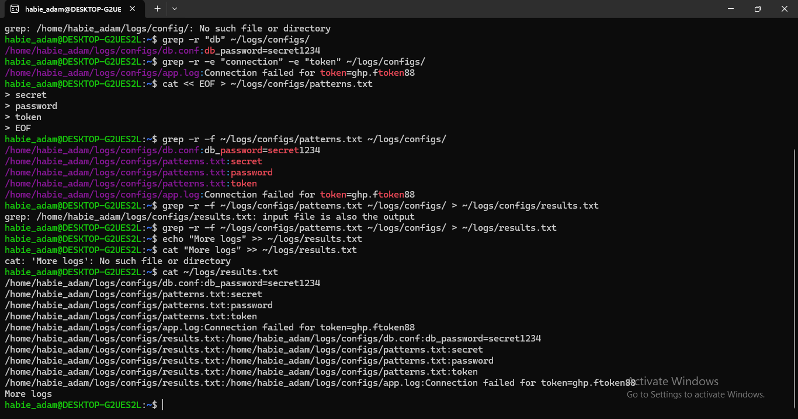

---

**What was done:**

-

**Explanations & Observations:**

-
-
-
-

---

## Scenario 7 – Shared Directory Stability Controls

<strong>Context:</strong> Developers report files disappearing from shared directories. The objective is to implement controls allowing file creation but preventing deletion of others' files.

