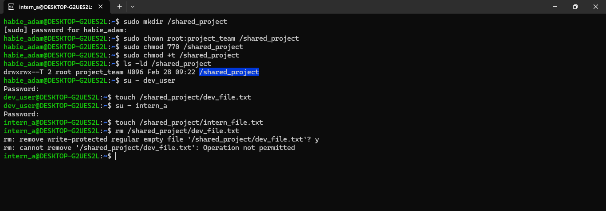

# DevSecOps Linux Hands-On Assignment 2 Documentation

## Overview

This documentation provides a complete walkthrough of Linux file security, permissions, and forensic scenarios. Each section includes executed commands, terminal output evidence, observations, and security implication.

## Scenario 1 – Shared Document Deletion Incident(Outlined Steps)

<strong>Context:</strong> An intern accidentally deleted a shared design document. The objective is to reproduce the incident and implement controls to prevent recurrence.

### Part A – Multi-User Simulation(Outlined Steps)

#### Step 1 - Creating Users (intern_a, dev_user, ops_user)
#### Step 2 - Creating Group and Assigning Users

### Part B – Reproducing the Incident

#### Step 1 - Creating Shared Directory and File
#### Step 2 - Logging in as intern_a and Deleting the File

### Part C – Preventing Recurrence (Outlined Steps)

#### Step 1 - Recreating the File
#### Step 2 - Applying Immutability Protection (chattr +i)
#### Step 3 - Testing Deletion as intern_a

**What was done:**

- To simulate the given scenario, users named `intern_a`, `dev_user`, and `ops_user` were created using the `sudo useradd -m -s` command. A group named `project_team` was also created, and the aforementioned users were assigned as members of the group, using `sudo groupadd project_team` and `sudo usermod -aG <user_name>`.
- Passwords were also set for relevant users using `sudo passwd <user_name>` to ensure they had an identity for authentication purposes.
- A new shared directory was created using borrowed root priviledges, with `sudo mkdir -p /shared/project_files`, and the ownership of the directory was given to the `project_team`. Members of the group were given read, write and execute permissions using `sudo chmod 770 shared/project_files`.
- SetGid was added to the directory using `chmod g+s <directory_name>` to ensure all files created in the directory belonged to the group, ensuring true collaboration.
- `intern_a` as a user from the project_team was then switched to, and had the ability to delete a file created by the `dev_user`
- The command `sudo chattr +i <path to directory>` was then executed finally.
- `intern_a` as a user from project_team was switched to again, and an attempt to delete the same file became futile.

**Explanations & Observations:**

- When `intern_a` first attempted to delete `shared_design.doc`, the deletion succeeded because the directory permissions (`770` with SetGID) granted all group members equal read, write, and execute access. Since `intern_a` belonged to `project_team`, they had full write permissions to the directory, which includes the ability to delete any file within it, regardless of who created it.
- With linux permissions (rwx), if a user has a write permission on a directory, they can delete any file inside of it, even files owned by others. Permissions control what a user, group or others can access, whiles Attributes control the file behavior itself. Setting `chattr + i` on a file ensures no modifications can be made to the file, not even by the root user.
- **Real production implications:**
  - **Shared collaboration directories** need both proper permissions AND attributes for true protection
  - **Critical config files** (e.g., `/etc/passwd`, application configs) should have `+i` attribute to prevent accidental or malicious modification.
  - **Audit logs** should use `+a` (append-only) to allow logging while preventing tampering.

## Scenario 2 – Log Overwrite Incident

<strong>Context:</strong> Application logs were overwritten, destroying forensic history. The objective is to simulate, prevent, and backup logs with proper metadata preservation.

#### Step 1 - Creating logs/app.log with 100+ Lines

#### Step 2 - Simulating Accidental Overwrite And Seeing Line Counts

#### Step 3 - Applying Overwrite Prevention Mechanism And Creating Backup

---

**What was done:**

- A dummy log directory was created using `mkdir -p logs`, containing a log file `app.log`. To get actual logs with at least 100 lines, the command `head -n 100 /var/log/syslog > logs/app.log` was executed, and the app.log file was confirmed to have 100 lines of content using `wc -l logs/app.log`.
- A new log was then redirected into the log file using `echo "<random log message>" > logs/app.log`. And the line count of the log file was confirmed to now have 1 line.
- `sudo chattr + a logs/app.log` was executed after, and a re attempt to redirect another log message proved futile, as an `Operation not permitted` message was received.
- A new directory named `archive` was then created using the `mkdir` command.
- `cp -p logs/app.log /archive` was run, and a confirmed duplicate of `app.log`, with it's exact content, was observed.

**Explanations & Observations:**

- Using `>`, meaning single redirection completely replaces the file content, destroying all historical data. Which is why 100 lines of possible data, was reduced to just 1 line. Attackers often use this technique to erase evidence of intrusion, and accidental overwrites can destroy critical debugging information.
- The `chattr +a` attribute allows only appending new data to a file—existing content cannot be modified or deleted, which is why the attempt to add content to the log file was no longer permitted.
- To preserve metadata, the `cp -p` was used to ensure the file's original timestamps, ownership and permissions remain the same, which is critical for forensics becausee
   - Timestamps show *when* events occurred.
   - Ownership shows *who* created the log.
   - Without `-p`, backups appear as newly created files, breaking the audit trail.
- **DevSecOps forensic significance:** :
   - **Incident Response** depends on unaltered logs to reconstruct attack timelines.
   - **Chain of custody** is broken if metadata is not preserved during backup

## Scenario 3 – Permission & Ownership Drift

<strong>Context:</strong> A deployment script copied incorrect data due to relative path usage. The objective is to reproduce and fix the issue using absolute paths.

#### Step 1 - Creating Files with Varying Permissions
#### Step 2 - Changing Ownership and Groups (chown, chgrp)
#### Step 3 - Copying Files WITHOUT Preservation Flags

#### Step 4 - Copying Files WITH Preservation Flags (cp -p)

#### Step 5 - Copying Files & Folders WITH Preservation Flags (cp -r)

---

**What was done:**
- 
-

**Explanations & Observations:**

-
-
-
-

---

## Scenario 4 – Relative Path Deployment Failure

<strong>Context:</strong> A deployment script copied incorrect data due to relative path usage. The objective is to reproduce and fix the issue using absolute paths.

- Incoming Step Evaluation Soon

---

## Scenario 5 – Monitoring Failure After Log Cleanup

#### Step 1 - Creating the Original Log File
#### Step 2 - Creating a Hard Link
#### Step 3 - Creating a Symbolic Link
#### Step 4 - Removing the Original File

**What was done:**
- A new log file named `og_log` was created with some content.
- The `ln og_log hard_link_log` command was executed to create a hard link, and the permissions of the files in the currnt directory was checkeed using `ls -li`. Two files were seen.
- The `ln -s og_log sym_log` command was run to create a symbolic link pointing to `og_log`.
- The `og_log` file was removed from the directory, and the content of `hard_link_log` was checked with the `cat` command.
- The content of `sym_log` was checked but the file no longer existed.

**Explanations & Behavorial Differences:**

- **Inode behavior - Hard Link:** When `og_log` was removed, `hard_link_log` still contained all the original content. This is because hard links point directly to the same inode (data blocks) on disk. Both filenames are equal references to the same data. When one filename is deleted, the inode and data remain until all hard links are removed. The `ls -li` command showed both files sharing the same inode number()

-  **Inode behavior - Symbolic Link:** When `og_log` was removed, `sym_log` became a broken link. Symbolic links store the *path* to the target file, not the inode itself. When the target file is deleted, the symlink points to a non-existent location, resulting in "No such file or directory" error. The symlink still exists but is unusable.

---

## Scenario 6 – Sensitive Data Exposure Hunt

<strong>Context:</strong> Security team suspects secrets are hidden in logs and config files. The objective is to scan for sensitive data using grep techniques and proper output redirection.

---

#### Step 1 - Simulating Logs and Using Recursive Scanning (grep -r)

#### Step 2 - Using Multiple Expressions (grep -e)

#### Step 3 - Using Pattern File (grep -f)

---

**What was done:**
-
-

**Explanations & Observations:**

-
-
-
-

---

## Scenario 7 – Shared Directory Stability Controls

<strong>Context:</strong> Developers report files disappearing from shared directories. The objective is to implement controls allowing file creation but preventing deletion of others' files.

#### Step 1 - Creating the Shared Directory
#### Step 2 - Giving Ownerships and Necessary Permissions
#### Step 3 - Applying Sticky Bit Control
### Step 4 - Testing File Creation
### Step 5 - Testing Deletion Prevention

---

**What was done:**

-
-

**Explanations & Observations:**

-
-
-

## Overall Conclusion