# DevSecOps Linux Hands-On Assignment 2 Documentation


## Overview

This documentation provides a complete walkthrough of Linux file security, permissions, and forensic scenarios. Each section includes executed commands, terminal output evidence, observations, and security implication.

## Scenario 1 – Shared Document Deletion Incident(Outlined Steps)

<p>
<strong>Context:</strong> An intern accidentally deleted a shared design document. The objective is to reproduce the incident and implement controls to prevent recurrence.
</p>

### Part A – Multi-User Simulation(Outlined Steps)

#### Step 1 - Creating Users (intern_a, dev_user, ops_user)
#### Step 2 - Creating Group and Assigning Users
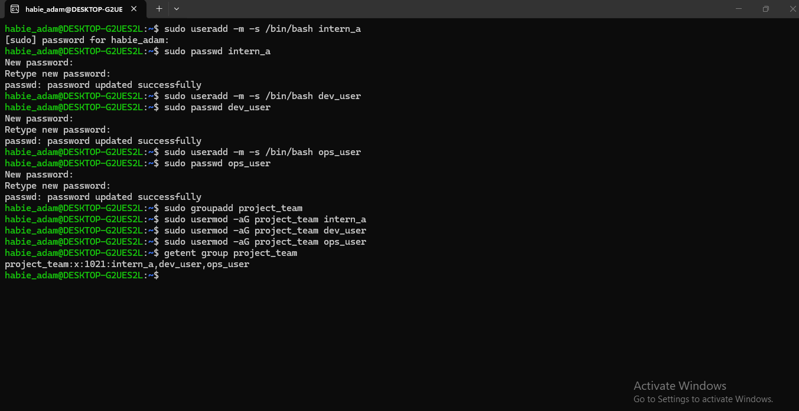


### Part B – Reproducing the Incident

#### Step 1 - Creating Shared Directory and File
#### Step 2 - Logging in as intern_a and Deleting the File

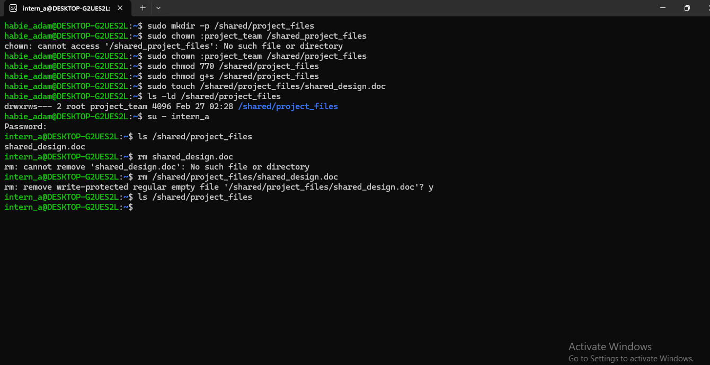


### Part C – Preventing Recurrence (Outlined Steps)

#### Step 1 - Recreating the File
#### Step 2 - Applying Immutability Protection (chattr +i)
#### Step 3 - Testing Deletion as intern_a

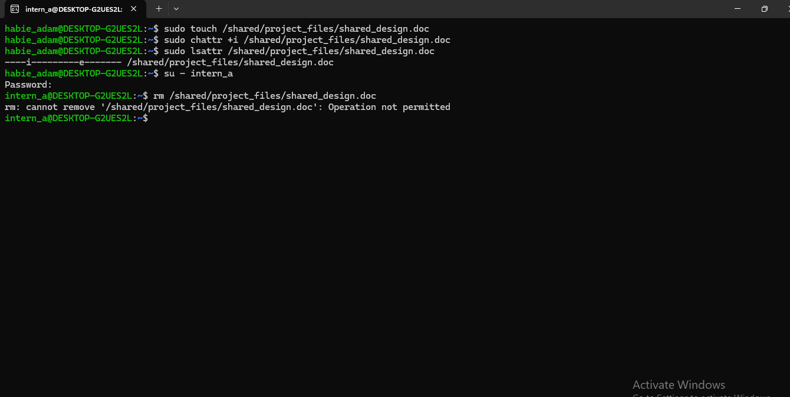

**What was done:**

- To simulate the given scenario, users named `intern_a`, `dev_user`, and `ops_user` were created using the `sudo useradd -m -s` command. A group named `project_team` was also created, and the aforementioned users were assigned as members of the group, using `sudo groupadd project_team` and `sudo usermod -aG <user_name>`.
- Passwords were also set for relevant users using `sudo passwd <user_name>` to ensure they had an identity for authentication purposes.
- A new shared directory was created using borrowed root priviledges, with `sudo mkdir -p /shared/project_files`, and the ownership of the directory was given to the `project_team`. Members of the group were given read, write and execute permissions using `sudo chmod 770 shared/project_files`.
- SetGid was added to the directory using `chmod g+s <directory_name>` to ensure all files created in the directory belonged to the group, ensuring true collaboration.
- `intern_a` as a user from the project_team was then switched to, and had the ability to delete a file created by the `dev_user`
- The command `sudo chattr +i <path to directory>` was then executed finally.
- `intern_a` as a user from project_team was switched to again, and an attempt to delete the same file became futile.

**Explanations & Observations:**

- When `intern_a` first attempted to delete `shared_design.doc`, the deletion succeeded because the directory permissions (`770` with SetGID) granted all group members equal read, write, and execute access. Since `intern_a` belonged to `project_team`, they had full write permissions to the directory, which includes the ability to delete any file within it, regardless of who created it.
- With linux permissions (rwx), if a user has a write permission on a directory, they can delete any file inside of it, even files owned by others. Permissions control what a user, group or others can access, whiles Attributes control the file behavior itself. Setting `chattr + i` on a file ensures no modifications can be made to the file, not even by the root user.
- **Real production implications:**
  - **Shared collaboration directories** need both proper permissions AND attributes for true protection
  - **Critical config files** (e.g., `/etc/passwd`, application configs) should have `+i` attribute to prevent accidental or malicious modification.
  - **Audit logs** should use `+a` (append-only) to allow logging while preventing tampering.

---

## Scenario 2 – Log Overwrite Incident
<p>
<strong>Context:</strong> Application logs were overwritten, destroying forensic history. The objective is to simulate, prevent, and backup logs with proper metadata preservation.
</p>

#### Step 1 - Creating logs/app.log with 100+ Lines
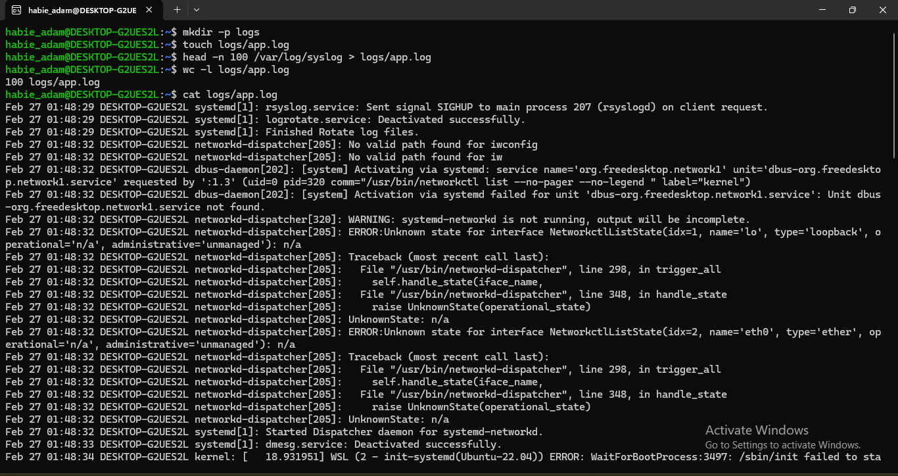

#### Step 2 - Simulating Accidental Overwrite And Seeing Line Counts
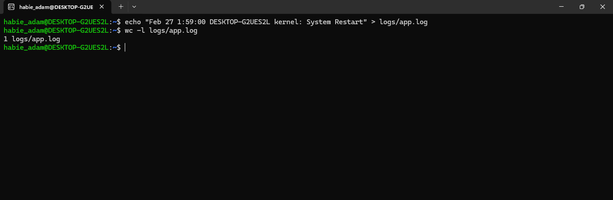

#### Step 3 - Applying Overwrite Prevention Mechanism And Creating Backup
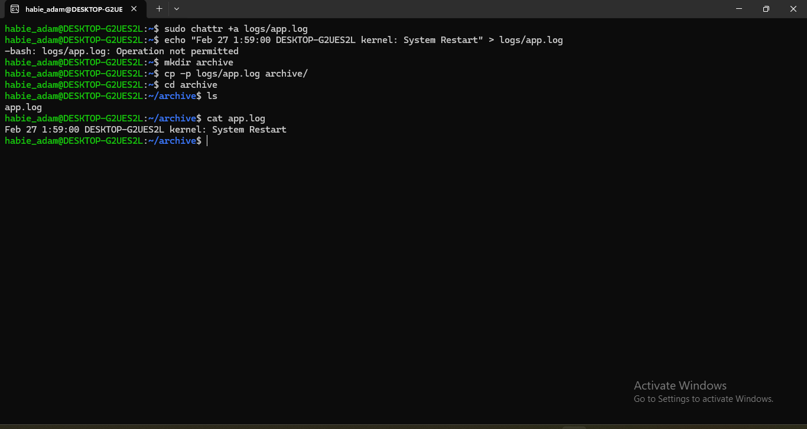


**What was done:**

- A dummy log directory was created using `mkdir -p logs`, containing a log file `app.log`. To get actual logs with at least 100 lines, the command `head -n 100 /var/log/syslog > logs/app.log` was executed, and the app.log file was confirmed to have 100 lines of content using `wc -l logs/app.log`.
- A new log was then redirected into the log file using `echo "<random log message>" > logs/app.log`. And the line count of the log file was confirmed to now have 1 line.
- `sudo chattr + a logs/app.log` was executed after, and a re attempt to redirect another log message proved futile, as an `Operation not permitted` message was received.
- A new directory named `archive` was then created using the `mkdir` command.
- `cp -p logs/app.log /archive` was run, and a confirmed duplicate of `app.log`, with it's exact content, was observed.

**Explanations & Observations:**

- Using `>`, meaning single redirection completely replaces the file content, destroying all historical data. Which is why 100 lines of possible data, was reduced to just 1 line. Attackers often use this technique to erase evidence of intrusion, and accidental overwrites can destroy critical debugging information.
- The `chattr +a` attribute allows only appending new data to a file—existing content cannot be modified or deleted, which is why the attempt to add content to the log file was no longer permitted.
- To preserve metadata, the `cp -p` was used to ensure the file's original timestamps, ownership and permissions remain the same, which is critical for forensics becausee
   - Timestamps show *when* events occurred.
   - Ownership shows *who* created the log.
   - Without `-p`, backups appear as newly created files, breaking the audit trail.
- **DevSecOps forensic significance:** :
   - **Incident Response** depends on unaltered logs to reconstruct attack timelines.
   - **Chain of custody** is broken if metadata is not preserved during backup

---

## Scenario 3 – Permission & Ownership Drift
<p>
<strong>Context:</strong> A deployment script copied incorrect data due to relative path usage. The objective is to reproduce and fix the issue using absolute paths.
</p>

#### Step 1 - Creating Files with Varying Permissions
#### Step 2 - Changing Ownership and Groups (chown, chgrp)
#### Step 3 - Copying Files WITHOUT Preservation Flags
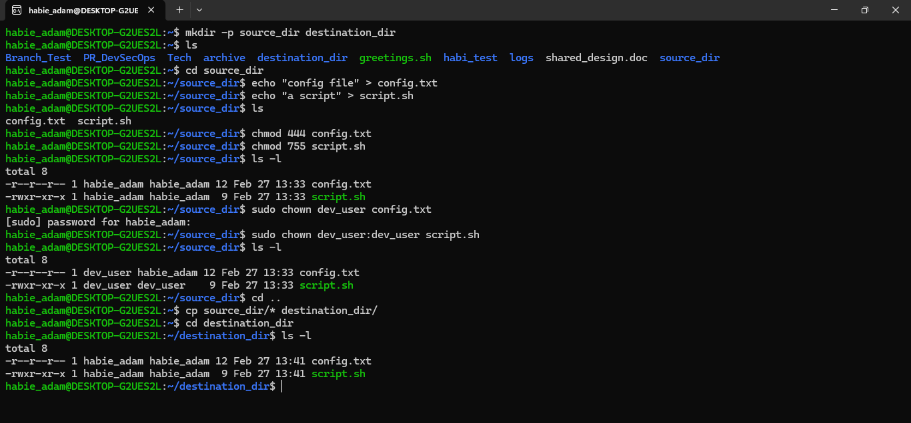

#### Step 4 - Copying Files WITH Preservation Flags (cp -p)
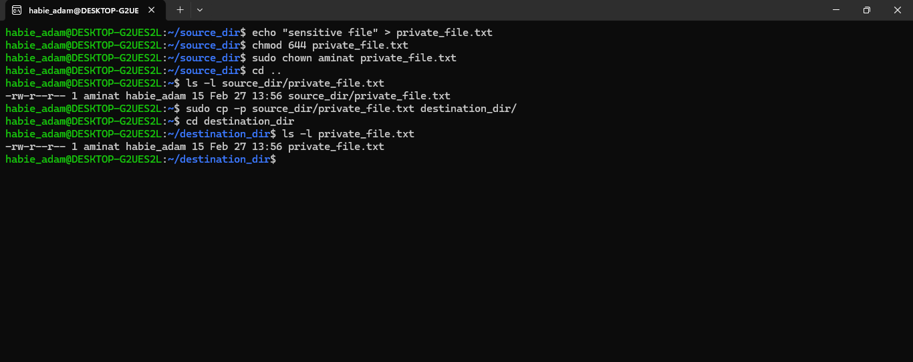

#### Step 5 - Copying Files & Folders WITH Preservation Flags (cp -r)
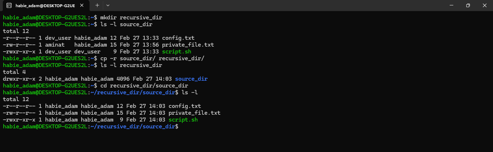


**What was done: cp alone**

- Two directories were created with `mkdir -p source_dir destination_dir`
- In `source_dir`, a file named `config.txt` was created and filled with some content, alongside a script file named `script.sh`
- Varying permissions such as the `444` was set for the config file, and `755` was set for the script file. The config file's ownership was changed to another user `dev_user` using `sudo chown dev_user config.txt`, and for the script, it's owner and group was set to also `dev_user` with `sudo chown dev_user:dev_user script.sh`.
- `ls -l` was run to verify the varrying permissions for both files.
- `cp source_dir/* destination_dir/` was executed, and then, the `destination_dir` directory was checked to verify the files and permissions had changed to the user running the `cp` command.

**What was done: cp - p**
- A new file named `private_file.txt` was created in the source directory with some dummy content, and its permission was sdt to `644`.
- Ownserhip of the file was given to another user `aminat`, using `sudo chown aminat private_file.txt`. Permissions of the file were checked using `ls -l source_dir/private_text.txt`
- `sudo cp -p source_dir/private_file.txt destination_dir/` was executed, and finally a permission check was done, to confirm the permissions were preserved.

**What was done: cp - r**

- A new directory was created using `mkdir recursive_dir`, with recursive_dir being the name of the directory.
- `cp -r sourcee_dir/ recursive_dir/` was executed.
- `cd recursive_dir/sourc_dir` was run to check and confirm the copied content and structure of the directory.


**Explanations & Observations:**

- **Observations on permission and ownership behavior (cp alone):**
   - When using `cp` without flags, the copied files inherited the permissions of the user executing the command, not the original file permissions. The copying user becomes the new owner, and default umask settings determine the new permissions.
   -  Both `config.txt` and `script.sh` originally owned by `dev_user` became owned by the user running the `cp` command. Group ownership also changed to the primary group of the copying user. This is because `cp` creates a *new file* in the destination, not a true copy of the inode.


- **Observations on permission and ownership behavior (cp -p):**
  - Using `cp -p` preserved the original permissions (`644`), ownership (`aminat`), and timestamps of `private_file.txt`. The `-p` flag maintains the file's identity across copy operations, ensuring security contexts remain intact. This requires `sudo` to preserve ownership to a different user.

- **Observations on permission and ownership behavior (cp -r):**
  - The `-r` (recursive) flag copied the entire directory structure and its contents. However, without `-p`, permissions and ownership reverted to the copying user's defaults.

---

## Scenario 4 – Relative Path Deployment Failure

<p>
<strong>Context:</strong> A deployment script copied incorrect data due to relative path usage. The objective is to reproduce and fix the issue using absolute paths.
</p>

#### Step 1 - Creating Directory Structure and Deployment Script
#### Step 2 - Running Script with Relative Paths (Failure)
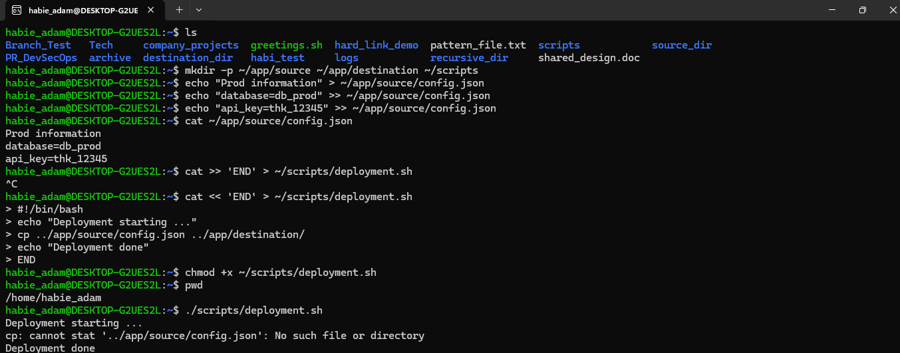

#### Step 3 - Correcting Script with Absolute Paths (Success)
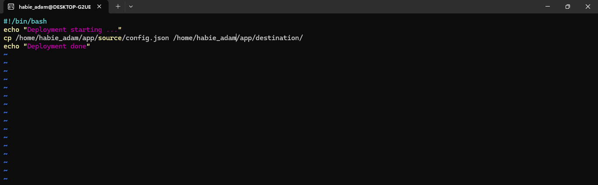

### Running Script and Testing From Other Directories
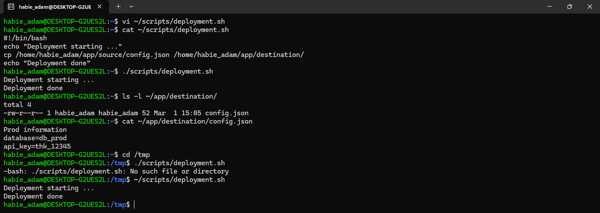


**What was done:**
- Created a directory structure: `mkdir -p ~/app/{source,destination}` and `mkdir -p ~/scripts`
- Created a source file named `config.json` in the `/app/source` direectory with dummy content containing app data, db info and fake api key.
- Created deployment script `~/scripts/deployment.sh` using relative paths:
  ```bash
  #!/bin/bash
  echo "Deployment starting ... "
  cp ../app/source/config.json ../app/destination/
  echo "Deploment done"
  ```
- Made the script executable: `chmod +x ~/scripts/deployment.sh`
- Navigated to the home directory and tried to execute the script, but had a failure with the cp command using the relative path.
- The script was the corrected to have the full absolute paths for copying from source to destination, and finally th script run from any location.

**Explanations & Observations:**
- **Why relative paths caused issues:** Relative paths (`../app/source/`) depend on the current working directory from which the script is executed. When the script was run from `~` (home directory), it looked for `../app/source/` relative to `~`, which doesn't exist. The script expected to be run from a specific location, making it fragile and error-prone.

- **How absolute paths fixed the problem:** Absolute paths (`/home/username/app/source/`) specify the exact location from the root directory (`/`), regardless of where the script is executed. This ensures the script works consistently from any location in the filesystem.
---

## Scenario 5 – Monitoring Failure After Log Cleanup

#### Step 1 - Creating the Original Log File
#### Step 2 - Creating a Hard Link
#### Step 3 - Creating a Symbolic Link
#### Step 4 - Removing the Original File
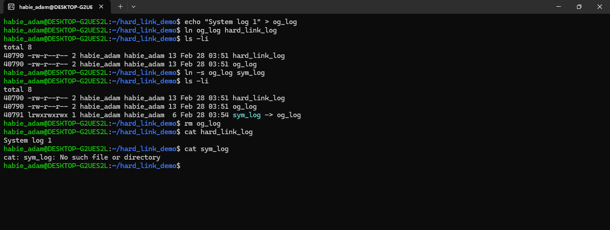

**What was done:**
- A new log file named `og_log` was created with some content.
- The `ln og_log hard_link_log` command was executed to create a hard link, and the permissions of the files in the currnt directory was checkeed using `ls -li`. Two files were seen.
- The `ln -s og_log sym_log` command was run to create a symbolic link pointing to `og_log`.
- The `og_log` file was removed from the directory, and the content of `hard_link_log` was checked with the `cat` command.
- The content of `sym_log` was checked but the file no longer existed.

**Explanations & Behavorial Differences:**

- **Inode behavior - Hard Link:** When `og_log` was removed, `hard_link_log` still contained all the original content. This is because hard links point directly to the same inode (data blocks) on disk. Both filenames are equal references to the same data. When one filename is deleted, the inode and data remain until all hard links are removed. The `ls -li` command showed both files sharing the same inode number()

-  **Inode behavior - Symbolic Link:** When `og_log` was removed, `sym_log` became a broken link. Symbolic links store the *path* to the target file, not the inode itself. When the target file is deleted, the symlink points to a non-existent location, resulting in "No such file or directory" error. The symlink still exists but is unusable.

---

## Scenario 6 – Sensitive Data Exposure Hunt

<p>
<strong>Context:</strong> Security team suspects secrets are hidden in logs and config files. The objective is to scan for sensitive data using grep techniques and proper output redirection.
</p>

---

#### Step 1 - Simulating Logs and Using Recursive Scanning (grep -r)

#### Step 2 - Using Multiple Expressions (grep -e)

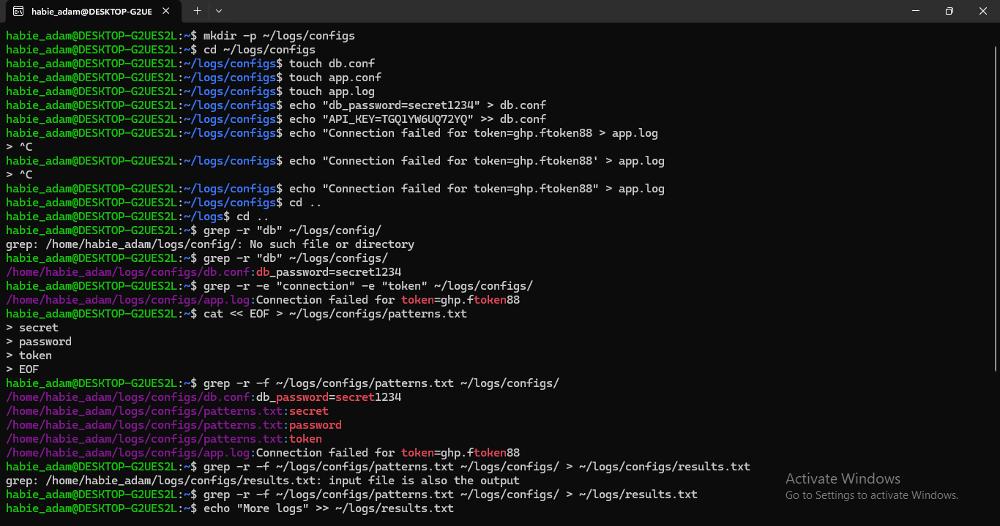

#### Step 3 - Using Pattern File (grep -f)
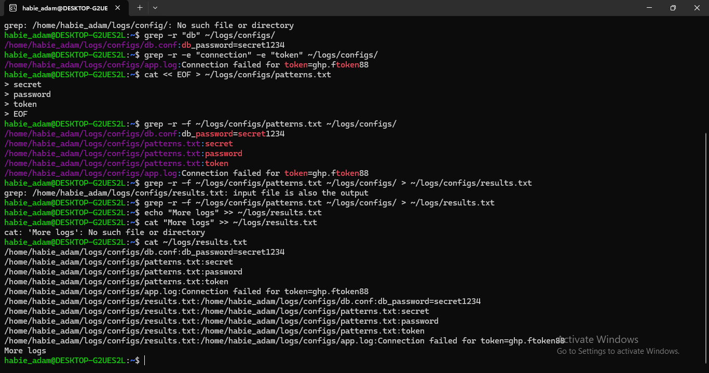

---

**What was done:**

- Dummy logs directory were created using `mkdir -p /logs/configs`. New files namd `app.log` and `db.conf` were created, and some fake db passwords, api key information, token and connection logs were sent into these files as content, to help simulate searching with `grep`.
- `grep -r "db" ~/logs/config` command was executed, and results of the file with db was returned.
- `grep -r -e "connection" -e "token"  ~/logs/config ` was run to chain different search terms together, and results matching the keywords were returned.
- `cat << EOF > ~/logs/configs/pattern.txt` was run, and keywords such as `secret`, `password`, `token` was inputted, and finally `EOF` to exit.
- Finally `grep -r -f ~logs/configs/pattern.txt ~/logs/configs > ~/logs/results.txt` was executed to store results of the search based on the written keywords in `patterns.txt`
- An additional log content was appended into `results.txt` using `echo "More logs" >> ~/logs/results.txt`. And finally, the entire content of results.txt was viewed.

**Explanations & Observations:**

- **Recursive scanning (grep -r):** The `-r` flag searched through all files within `~/logs/config` directory and its subdirectories, finding matches for "db" in both `app.log` and `db.conf`. This eliminates the need to manually search each file individually, making it essential for scanning large directory structures in production environments.

- **Multiple expressions (grep -e):** Using `-e` allowed chaining multiple search patterns in a single command. `grep -r -e "connection" -e "token"` searched for both keywords simultaneously, returning all lines containing either term. This is more efficient than running separate grep commands and combining results.

- **Pattern file (grep -f):** The `pattern.txt` file contained multiple keywords (`secret`, `password`, `token`), and `grep -f` used this file as input to search for all patterns at once.

- **Why both redirection operators are used:**
  - **`>` (Single redirect):** Overwrites the file completely. `grep -r -f pattern.txt ~/logs/configs > ~/logs/results.txt` created a fresh `results.txt` with only the current scan results.
  - **`>>` (Append redirect):** Adds content without destroying existing data. `echo "More logs" >> ~/logs/results.txt` appended additional information to `results.txt` without losing the grep results.


---

## Scenario 7 – Shared Directory Stability Controls

<p>
<strong>Context:</strong> Developers report files disappearing from shared directories. The objective is to implement controls allowing file creation but preventing deletion of others' files.
</p>

#### Step 1 - Creating the Shared Directory
#### Step 2 - Giving Ownerships and Necessary Permissions
#### Step 3 - Applying Sticky Bit Control
### Step 4 - Testing File Creation
### Step 5 - Testing Deletion Prevention


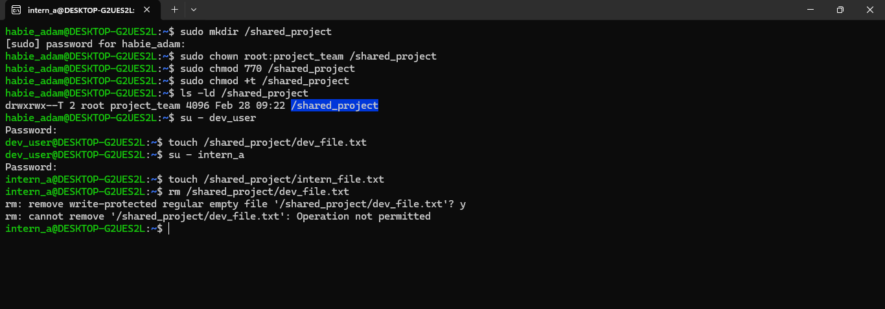


---

**What was done:**

- A new directory named `shared_project` was created using `sudo mkdir /shared_project`.
- The directory's group ownership was set to `project_team` and full permissions (rwx) was assigned to the group.
- A sticky bit was assigned to the directory using `chmod +t /shared_project`.
- A user from the project_team `dev_user` was switched to, and `dev_user` creates a file named `dev_file.txt` using `touch /shared_project/dev_file.txt`
- A switch was then made to a user belonging to the project_team, aka `intern_a`.
- The intern run a touch command within the shared_project directory to create a file named `intern_file.txt`, and was succesful.
- `intern_a` runs `rm /shared_project/dev_file.txt` and gets an `Operation not permitted output`.

**Explanations & Observations:**

- **Mechanism used - Sticky Bit (`chmod +t`):** The sticky bit is a special permission that modifies directory deletion behavior. When set on a directory, it restricts file deletion so that only the file owner, directory owner, or root can delete files—regardless of write permissions. This is represented by a `t` in the permissions display

- **How it solved the problem:** Without the sticky bit, any user with write permission to `/shared_project` could delete any file in it (as seen in Scenario 1). After applying `chmod +t`, `intern_a` successfully created `intern_file.txt` (showing collaboration works) but received "Operation not permitted" when attempting to delete `dev_file.txt` owned by `dev_user`. This prevents accidental or malicious deletion while preserving shared collaboration.

- For **security reasoning**:
  - It prevents data loss, as developers can't accidentally delete teammates work in a shared directory
  - Only file owners control their own files, enforcing ownership responsibility.
  -  Users can create and modify their own files without fear of deletion by others.


## Overall Conclusion