# Docker Container Security — Hands-On Lab Documentation


---

## Introduction

This documentation records a hands-on self-study lab I completed covering Docker container security from first principles. Rather than simply listing commands, each scenario explains the *why* behind every decision and demonstrates the security implications through direct observation. Every scenario includes screenshots from the lab as a source of verification.

By completing these scenarios, I built progressively more secure versions of the same Node.js application and developed a concrete understanding of:

- Why the default Docker configuration is insecure
- How privilege escalation risk is introduced by running as root
- How secrets leak into images unintentionally
- How multi-stage builds reduce the attack surface
- How runtime hardening restricts container capabilities

---


## The Sample Application

The application is intentionally minimal. Its sole purpose is to report the user ID of the process running inside the container, making the root vs. non-root difference immediately visible in terminal output.

**`app.js`** — starts an HTTP server on port 3000 and responds with:
- The numeric user ID (`process.getuid()`)
- A human-readable label (`root -- DANGER` or `non-root (uid: N)`)
- The container hostname

**`package.json`** — declares the project metadata and `npm start` script.

**`.env`** — simulates a production secrets file containing a database password, API key, and Stripe secret. Used in Scenario 1 to demonstrate accidental secret leakage.

---

## Scenario 1 — The Insecure Default

### Objective

In this scenario, I examined what a basic Dockerfile looks like, why it is insecure by default, and how Docker layer caching works in practice using timed builds.

### Dockerfile Used

> Check this file -> [`Dockerfile`](./Dockerfile)

### Key Concepts Demonstrated

- Running as root (UID 0)
- Unfiltered `COPY . .` leaking secrets into the image
- Layer caching behaviour and how instruction order affects build speed

### Steps & Observations

#### Step 1 — Build the Image (First Build)

**Command:**
```bash
time docker build -f Dockerfile -t insecure-app .
```

**Observed output / screenshot:**

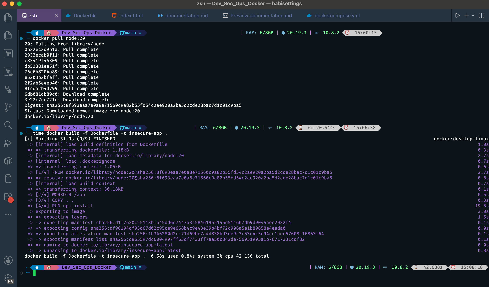
-

**Observation:**

- As this is the first build, it takes a bit of time, approximately 0.58seconds

---

#### Step 2 — Second Build (Cached)

**Command:**
```bash
time docker build -f Dockerfile -t insecure-app .
```

**Observed output/screenshot:**

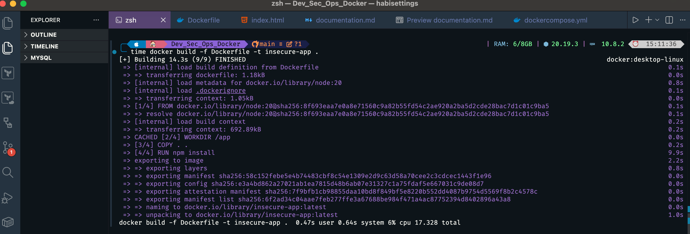

**Observation:**

- The time it took for the second build is relatively faster than the first build(0.48seconds)
- Each layer now shows CACHED because Docker re-used each layer from the first build

#### Step 3 — Third Build (Code Change — Cache Invalidation)

Added `// version 2` comment to the top of `app.js`, then rebuilt.

**Command:**
```bash
time docker build -f Dockerfile -t insecure-app .
```

**Observed output / screenshot:**

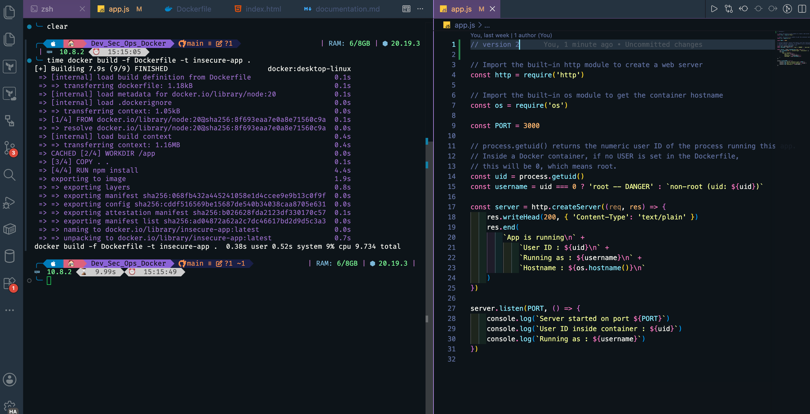


**Observation:**

- After the content of app.js was changed, the ```COPY . . ``` layer was invalidated
- Every layer above it was also re-executed, introducing the caching problem introduced by the ```COPY ...``` layer.

---

#### Step 4 — Running the Container

**Command:**
```bash
docker run -p 3000:3000 insecure-app
curl http://localhost:3000
```

**Observed output / screenshot:**

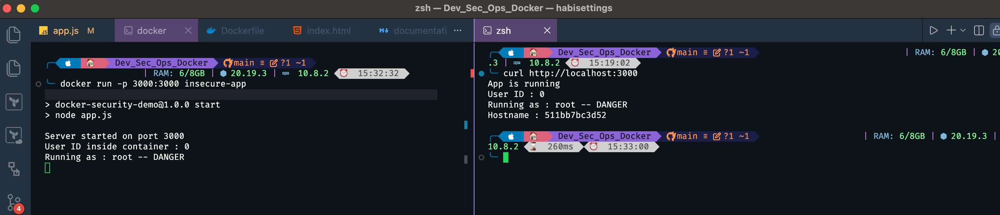

**Observation:**

- From the output, the current userId indicates that this is the root user
- The container and everything inside is operated with full unrestricted access

#### Step 5 — Confirming the Secret Leak

**Commands:**
```bash
docker exec -it $(docker ps -q) sh
cat /app/.env
```

**Observed output / screenshot:**
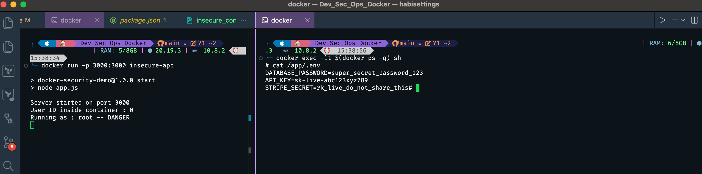

**Observation:**

- After opening a shell inside the container, and running the `cat /app.env/` command, it revealed that the credentials were copied alongside the container.
- Anyone who has acccess to this container can view secrets easily.

#### Final System Resetting

**Commands:**
```bash
docker system prune -af
```
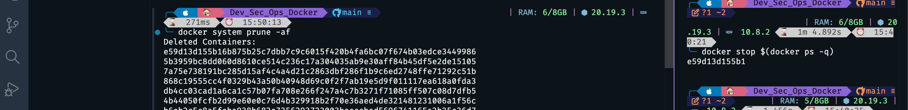


### Checkpoint Answers

1. Running `docker exec -it $(docker ps -q) whoami` printed `root`. This means the process inside the container runs with UID 0 — the same identity that owns system files and binaries on the host. Any action the process takes, or that an attacker can coerce it into taking, is performed with unrestricted privileges inside the container.

2. The first build took several seconds as each layer was downloaded and executed from scratch. The second build completed almost instantly — all layers showed `CACHED` because nothing in the Dockerfile or the build context had changed since the previous run.

3. After editing `app.js`, the first layer that was **not** cached was the `COPY . .` instruction — because the build context had changed. The layer immediately below it, `RUN npm install`, **was** cached. This exposes the problem: `npm install` ran after the cache break even though no dependencies changed.

### Reflection

1. If the image contained real AWS access keys in `.env` and was pushed to a public Docker Hub repository, automated bots that continuously scan public registries for secrets would detect and exfiltrate the credentials within minutes. An attacker could then use them to spin up infrastructure, exfiltrate data from S3, or rack up significant charges — all before the exposure is noticed.

2. To prevent `RUN npm install` from re-running on every code change, the `COPY` instruction should be split: copy `package.json` and `package-lock.json` first, run `npm install`, then copy the rest of the application code. Docker caches each layer independently, so the install layer is only invalidated when the dependency files themselves change, not when `app.js` does.

## Scenario 2 — Running as a Non-Root User

### Objective

In this scenario, I stopped the application from running as root and observed concretely what that change protects against.

### Dockerfile Used

> Check this file -> [`Dockerfile.nonroot`](./Dockerfile.nonroot)

### Key Concepts Demonstrated

- Creating a dedicated system user and group inside the image
- The `USER` instruction and when it takes effect
- `chown` to transfer file ownership before switching users

### Steps & Observations

#### Step 1 — Resetting the Environment

**Command:**
```bash
docker system prune -af
```

---

#### Step 2 — Building and Running the Non-Root Image

**Commands:**
```bash
docker build -f Dockerfile.nonroot -t nonroot-app .
docker run -p 3000:3000 nonroot-app
curl http://localhost:3000
```

**Observed output / screenshot:**

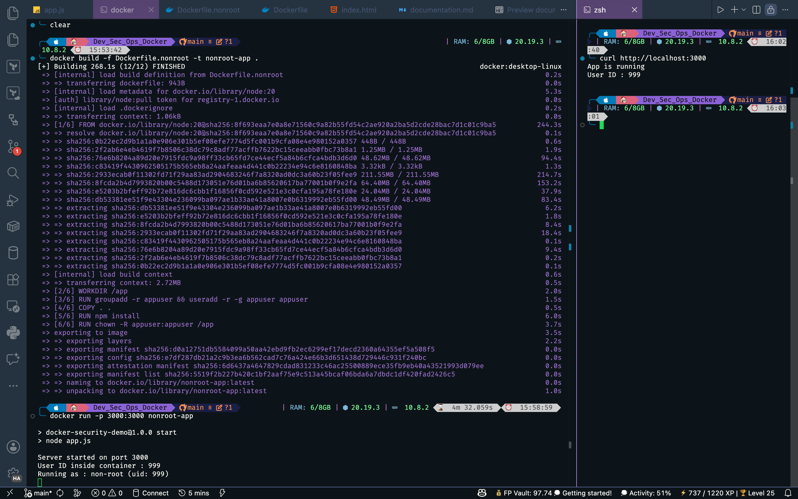

**Observation:**

- The application is now running as a non root user as the userId is now 999 and not as the root lole before.
- Access is now restricted.

---

#### Step 3 — Verifying the Permission Boundary

**Commands:**
```bash
docker exec -it $(docker ps -q) sh
echo "test" > /etc/passwd
apt-get install curl
touch /bin/backdoor
```

**Observed output / screenshot:**

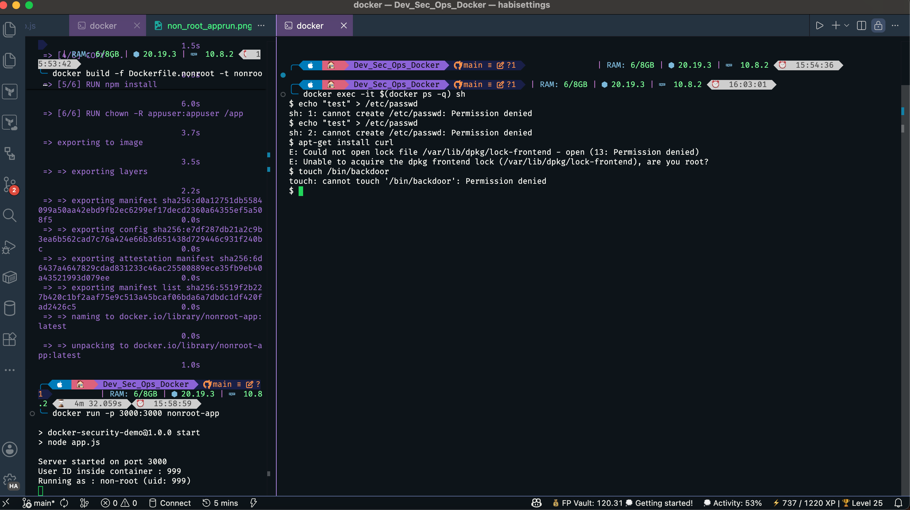

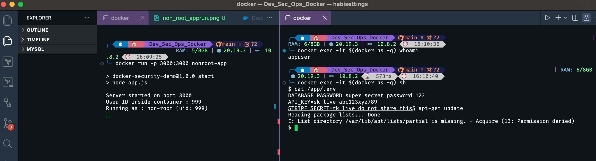

**Observation:**

- The current user is unable to execute the actions above as they ar not the root user.
- Any attacker that gets access to the application should inherit these restrictions.


---

#### Step 5 — Resetting the Environment

**Command:**
```bash
docker system prune -af
```

**Observed output / screenshot:**

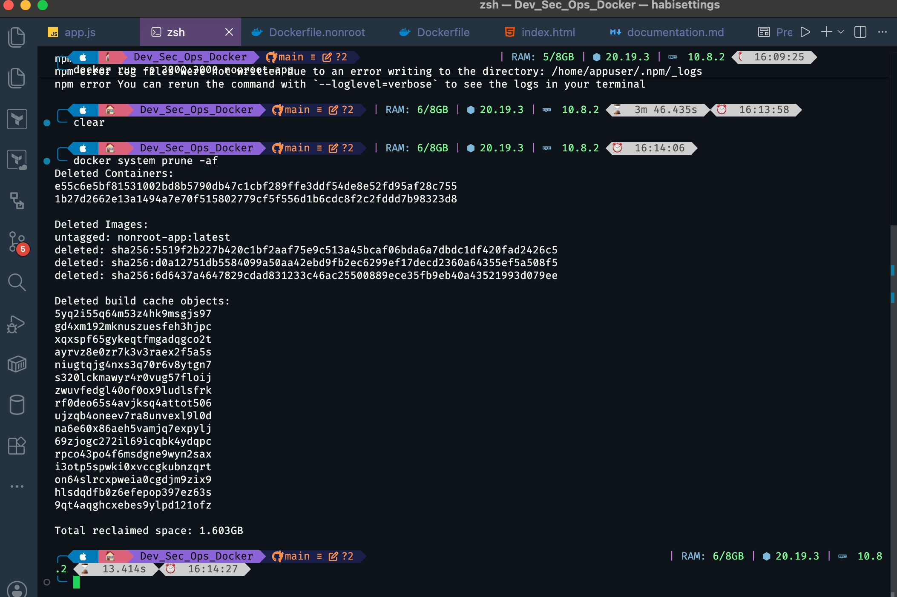

### Checkpoint Answers

1. Running `docker exec -it $(docker ps -q) whoami` printed `appuser` — confirming the process no longer runs as root.
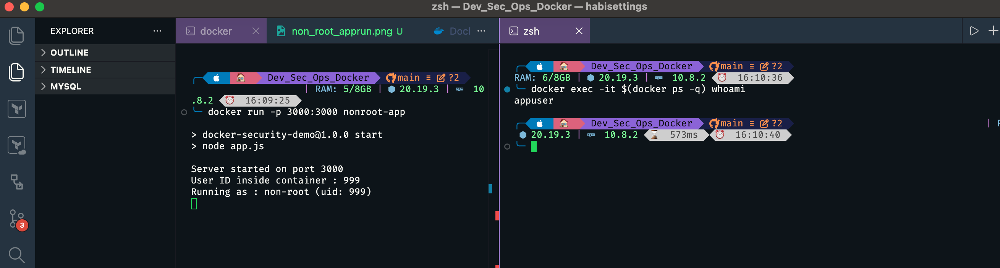

2. Running `cat /app/.env` inside the container succeeded — `appuser` could read the file. This shows that switching to a non-root user does **not** protect secrets stored inside the image; it only removes kernel-level privileges. Filesystem permissions still apply normally, so any file readable by `appuser` is still exposed to anyone who can exec into the container.


3. Running `apt-get update` failed with a permission denied error. The relevant part of the error message was the complaint about being unable to open or write to `/var/lib/apt/lists/` — directories owned by root. This confirms that `appuser` cannot perform administrative or package-level operations, which is exactly the protection non-root users provide.

### Reflection

1. Switching to a non-root user closes off privilege escalation paths and prevents an attacker from using the container process to tamper with system binaries or call privileged kernel APIs. It does not, however, protect secrets baked into the image — those require `.dockerignore`, multi-stage builds, or runtime secret injection.

---

## Scenario 3 — Protecting Secrets with .dockerignore

### Objective

In this scenario, I prevented sensitive files from ever entering the image build context by introducing a `.dockerignore` file.

### Dockerfile Used

`Dockerfile` (with `.dockerignore` now present)

### Key Concepts Demonstrated

- The Docker build context and what `COPY . .` actually copies
- How `.dockerignore` filters files before they reach the daemon
- Verifying that a file is absent from a built image

### Steps & Observations

#### Step 1 — Creating the `.dockerignore` File

The following entries were added to exclude sensitive and unnecessary files from the build context:

> File can be found here >  [`.dockerignore`](./.dockerignore)

```
.env
.git
*.md
node_modules
```

---

#### Step 2 — Rebuilding the Image and Inspecting for the Secret

**Commands:**
```bash
docker build -f Dockerfile.nonroot -t secure-copy-app .
docker run --rm secure-copy-app find /app -type f

```

**Observed output / screenshot:**

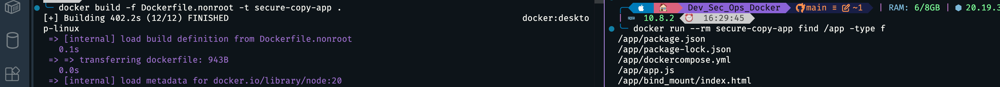

**Observation:**

- The output after trying to find the content of the app directory this time, did not return the `.env` file


---

#### Step 3 — Confirming Secret Cannot Be Read

**Command:**
```bash
docker exec -it $(docker ps -q) sh
cat /app/.env
```

**Observed output / screenshot:**

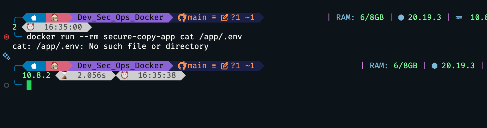

**Observation:**

- The output returned `No such file or directory` because dockerignore file removed the `.env`.


---

#### Step 4 — Resetting the Environment

**Command:**
```bash
docker system prune -af
```

**Observed output / screenshot:**

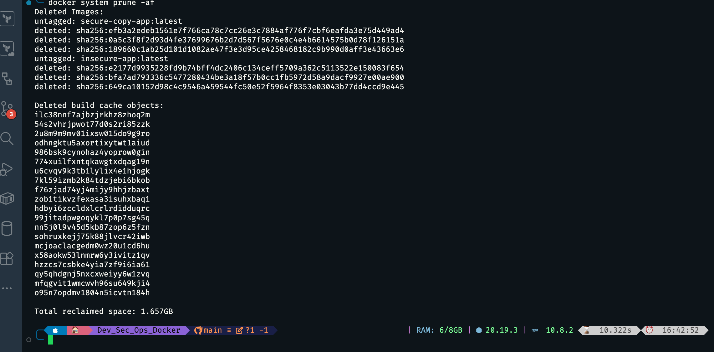

### Checkpoint Answers

1. Running `docker run --rm secure-copy-app find /app -type f` listed the application files but `.env` was **not** among them. The `.dockerignore` file stripped it from the build context before `COPY . .` ran, so it never entered the image layer at all.

2. After creating `test.pem` in the project folder and rebuilding, the `find` output **did** include `test.pem`. Because only `.env` was listed in `.dockerignore`, `COPY . .` copied everything else — including the new certificate file — into the image without restriction.

3. After temporarily removing `.dockerignore` and rebuilding, the `find` output now included `.env` alongside the other files. With no exclusion rules in place, `COPY . .` copied the entire build context verbatim, pulling the secret file straight into the image. Adding `.dockerignore` back restored the protection.

### Reflection

1. `.dockerignore` prevents secrets from entering the image in the first place — it is a build-time control, not a runtime one. It must be treated as a mandatory file in any project that has a `COPY . .` instruction, since there is no other mechanism to retroactively remove a file that was baked into a layer.

---

## Scenario 4 — Multi-Stage Builds

### Objective

In this scenario, I reduced the final image size and attack surface by separating the build environment from the runtime environment using a multi-stage Dockerfile.

### Dockerfile Used

> Check this file -> [`Dockerfile.nultistage`](./Dockerfile.multistage)

### Key Concepts Demonstrated

- Named build stages (`AS builder`)
- `--from=builder` to copy only the necessary artefacts into the final image
- The size difference between `node:20` and `node:20-alpine`
- Build tools and source files that do not appear in the final image

### Steps & Observations

#### Step 1 — Building the Multi-Stage Image

**Command:**
```bash
docker build -f Dockerfile.multistage -t multistage-app .
```

---

#### Step 2 — Comparing Image Sizes

**Command:**
```bash
docker images
```

**Observed output / screenshot:**

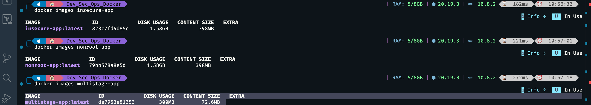

**Observation:**

-
-

---

#### Step 3 — Running the Multi-Stage Image

**Commands:**
```bash
docker run -p 3000:3000 multistage-app
curl http://localhost:3000
```

**Observed output / screenshot:**

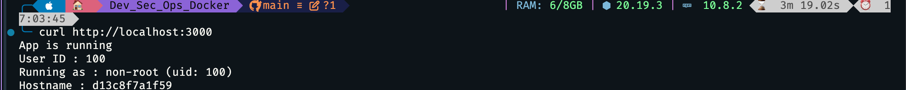

**Observation:**

-
-

---

#### Step 4 — Confirming the Reduced Attack Surface

**Commands:**
```bash
docker exec -it $(docker ps -q) sh

npm --version
curl --version
git --version
apt-get install wget
```

**Observed output / screenshot:**

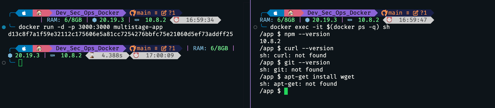

**Observation:**

-
-

---

### Step 5 - Confirming MultiStage App Works


#### Step 6 — Resetting the Environment

**Command:**
```bash
docker system prune -af
```

**Observed output / screenshot:**

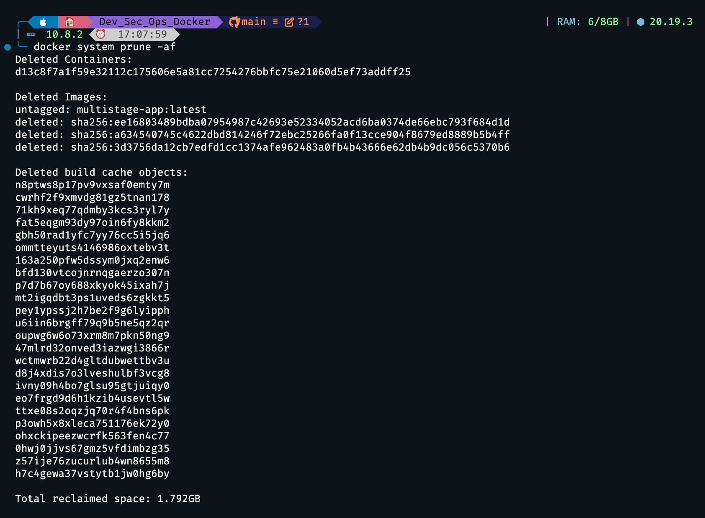

### Checkpoint Answers

1.
2.
3.

### Reflection

1.
2.

---

## Scenario 5 — Runtime Hardening

### Objective

In this scenario, I applied Linux kernel-level restrictions to a running container to limit what a compromised process can do.

### Dockerfile Used

`Dockerfile.multistage` (with runtime flags applied at `docker run`)

### Key Concepts Demonstrated

- `--read-only` filesystem to prevent writes at runtime
- `--cap-drop ALL` to remove all Linux capabilities
- `--no-new-privileges` to prevent privilege escalation via setuid binaries
- `--memory` and `--cpus` to constrain resource usage
- `--security-opt` and seccomp profiles

### Steps & Observations

#### Step 1 - Rebuilding MultiStage App

```bash

docker build -f Dockerfile.multistage -t multistage-app .
```

### Step 2 - Applying The First Flag - Read Only File System

```bash
docker run --read-only --tmpfs /tmp -p 3000:3000 multistage-app
```

Second Terminal
```bash
docker exec -it $(docker ps -q) sh -c "echo test > /app/hacked.txt"
```

Stopping The Container
```bash
docker stop $(docker ps -q)
```

**Observed output / screenshot:**

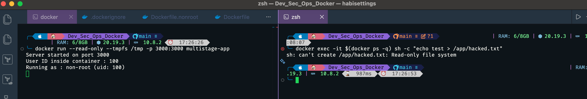

**Observations:**

-
-

### Step 3 - Applying The Memory and Cpu Limits

```bash
docker run --memory="128m" --cpus="0.5" -p 3000:3000 multistage-app
```

Verifying The Limits

```bash
docker inspect $(docker ps -q) | grep -E '"Memory"|"NanoCpus"'
```

Stopping The Container
```bash
docker stop $(docker ps -q)
```

**Observed output / screenshot:**

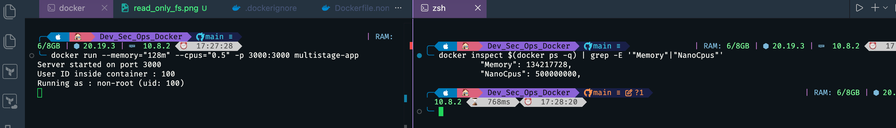


**Observations:**

-
-

### Step 3.1 - Dropping Linux Capabilities

```bash
docker run --cap-drop=ALL -p 3000:3000 multistage-app
```

Confirming The Application Responds By Running

```bash
curl http://localhost:3000
```

**Observed output / screenshot:**

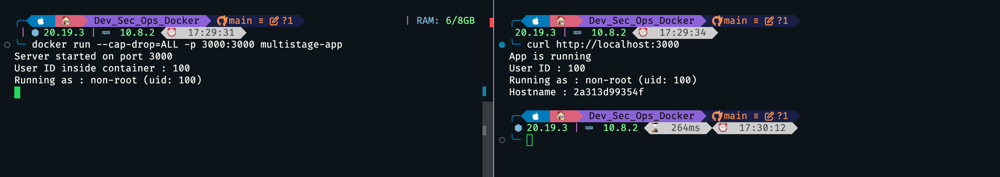


#### Step 4 — Running the Fully Hardened Container

**Command:**
```bash
docker run -d -p 3000:3000 \
  --read-only \
  --cap-drop ALL \
  --no-new-privileges \
  --memory 128m --cpus 0.5 \
  --tmpfs /tmp \
  multistage-app
```

**Observed output / screenshot:**

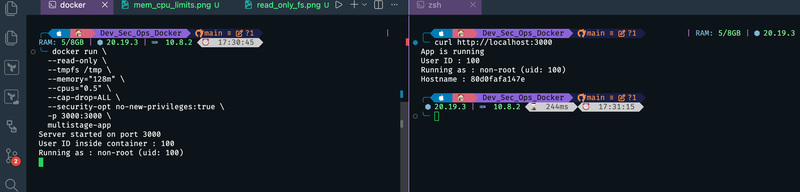

**Observation:**

-
-

---

#### Step 5 — Further Inspection

**Observed output / screenshot:**

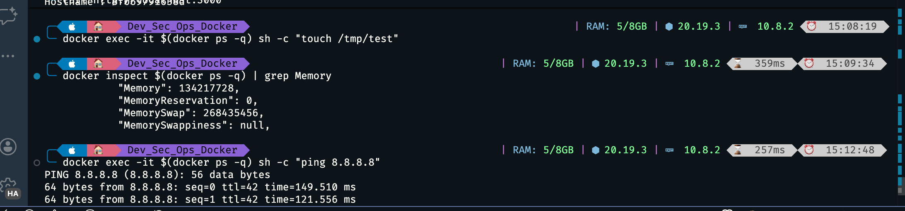

**Observation:**

-
-

---

#### Step 6 — Resetting the Environment

**Command:**
```bash
docker system prune -af
```

**Observed output / screenshot:**

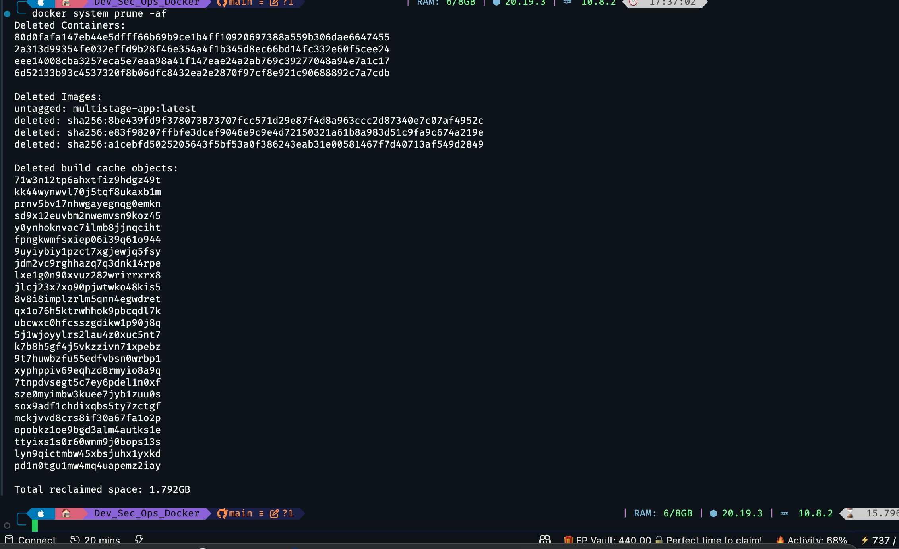

### Checkpoint Answers

1.
2.
3.

### Reflection

1.
2.


## Conclusion


## References

- [Docker Official Documentation](https://docs.docker.com/)
- [OWASP Docker Security Cheat Sheet](https://cheatsheetseries.owasp.org/cheatsheets/Docker_Security_Cheat_Sheet.html)
- [CIS Docker Benchmark](https://www.cisecurity.org/benchmark/docker)
- [Node.js Docker Best Practices](https://github.com/nodejs/docker-node/blob/main/docs/BestPractices.md)
