# DockerQuiz — Running a Multi-Container App with Docker Compose


---

## Introduction

In this project, I orchestrated a multi-container application using Docker Compose. The application is a Docker-themed quiz built with Flask (Python), backed by MongoDB for data persistence, and paired with Mongo Express for visual database browsing.

Rather than running three separate `docker run` commands and manually connecting containers, A single file`docker-compose.yml` is used to define the entire stack — the application image, the database, the network, and the volumes.

>Find detailed explanation within file [Docker-compose.yml](Docker-compose.yml)

**What I covered in this project:**
- Building a custom Docker image from a Dockerfile
- Pulling official images from Docker Hub
- Connecting containers via a shared bridge network using Docker DNS
- Persisting data across container restarts using named volumes
- Defining service dependencies and startup order

**Stack:**
| Service | Technology | Role |
|---|---|---|
| Quiz App | Flask (Python 3.11) | Web application |
| Database | MongoDB 7.0 | Data persistence |
| DB Browser | Mongo Express 1.0.2 | Visual database UI |

---

## Step 1 —> Clone the Repository

I started by cloning the repository and navigating into the project folder.

```bash
git clone https://github.com/samuel-nartey/devops-labs.git
cd devops-labs/Docker\ \&\ Containers/Running\ Your\ First\ Container/running\ docker\ compose
```
---

## Step 2 —> Start All 3 Containers

I ran the following single command to build and start the entire stack:

```bash
docker compose up --build
```

This single command:
- Built the `quiz-app` image from the `Dockerfile` in this folder
- Pulled the official `mongo:7.0` image from Docker Hub
- Pulled the official `mongo-express:1.0.2` image from Docker Hub
- Created the `quiz-network` bridge network
- Created the `mongo-data` named volume for data persistence
- Started all 3 containers and connected them

> **First run note:** Docker had to download the MongoDB and Mongo Express images, which took a couple of minutes(My internet was slow). Every run after the first was nearly instant.

**Screenshot:**
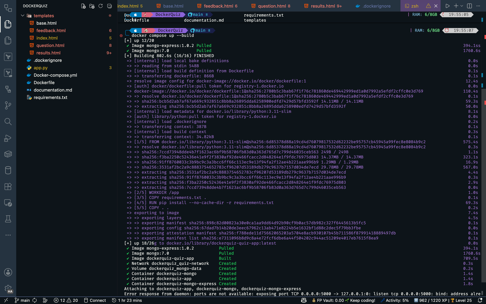


**Observation:**

- The `mongo-express:1.0.2` image, followed by the `mongo:7.0` image, then the `quiz-app` were pulled first, a dedicated network was created, and containers based on these images were built.

- I encountered an issue with port mapping for the `5000` and so I had to modify the port in `Docker-compose.yml` to use port `5001` instead for the `quiz-app`.

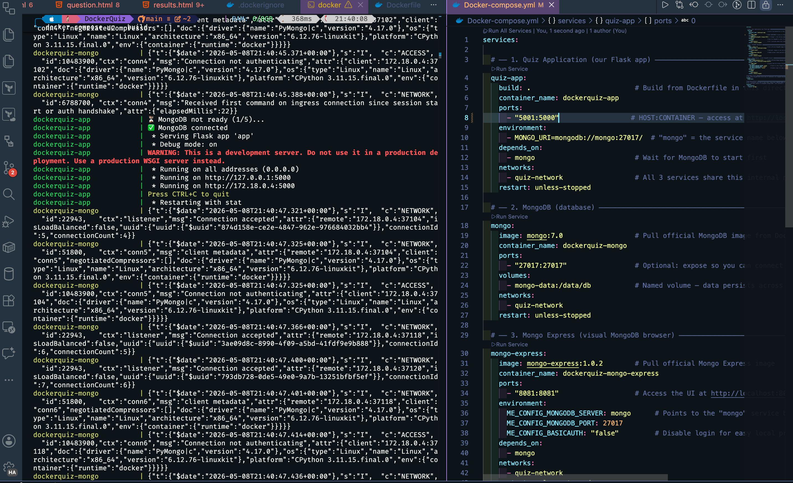

---

## Step 3 —> Open the Apps

Once I saw `quiz-app | * Running on http://0.0.0.0:5000` in the terminal, I opened both services in my browser. Note that while Flask reports port `5000` internally inside the container, I had changed the port mapping in `docker-compose.yml` to `5001:5000`, so the app is actually reachable on port `5001` from my machine:

| Service | URL | What it does |
|---|---|---|
| 🐋 Quiz App | http://localhost:5001 | Create your profile and play the quiz |
| 🍃 Mongo Express | http://localhost:8081 | Browse your MongoDB data visually |


**Screenshot:**

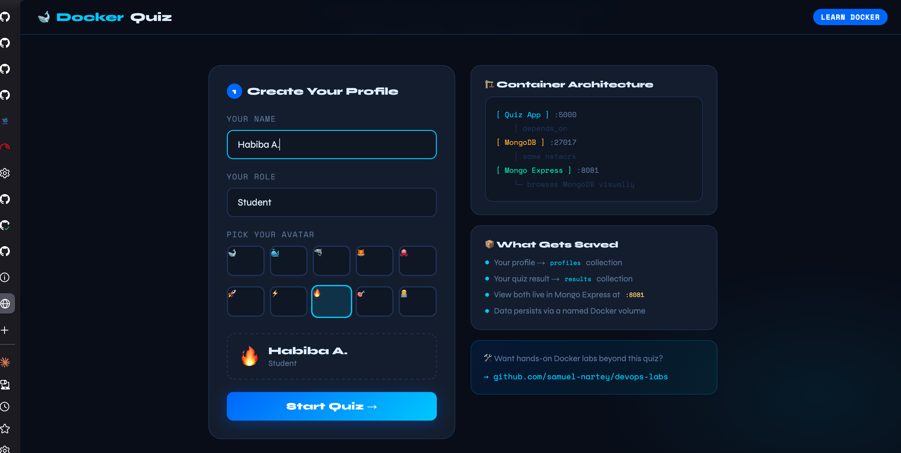

**Observation:**

- The quiz app opens and requires a name, role and avatar to create a profile for the current player.
- Initially the mongodb side had no profiles created, until I created a profile and played the quiz.

---

## Step 4 —> Play the Quiz and Explore My Data
1. I navigated to http://localhost:5001
2. I created my profile — entered my name, picked a role and an avatar
3. I answered all 20 Docker questions
4. On the results page, I noted my grade
5. I opened http://localhost:8081 → clicked `dockerquiz` → opened `profiles`, `results`, and `quiz_states`

I could see my own data — written by the Flask container, stored in the MongoDB container, and browsed through the Mongo Express container.

**Screenshot:**

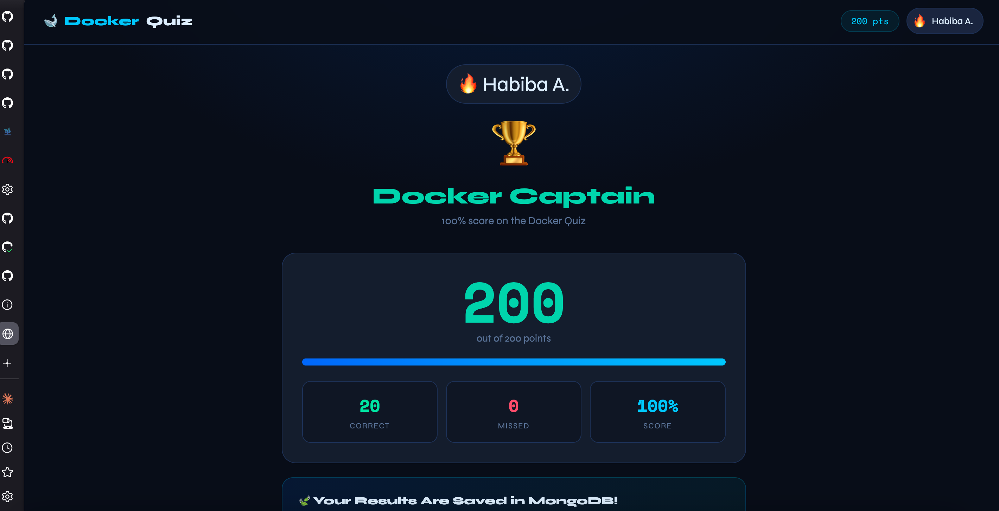

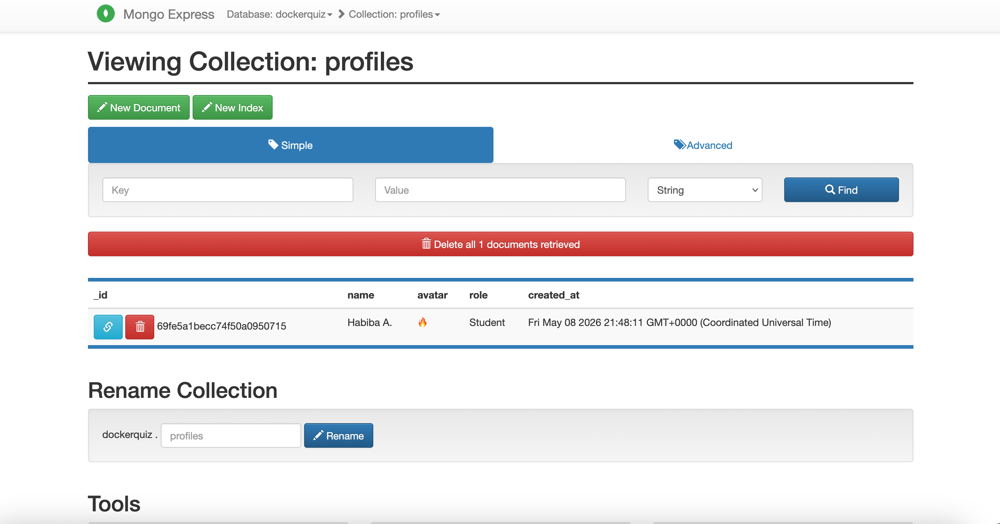


## Some Commands Run Whiles Containers Were Still Running

```bash
# See all 3 running containers and their status
docker ps
# Stream live logs from the quiz app
docker logs dockerquiz-app -f
```
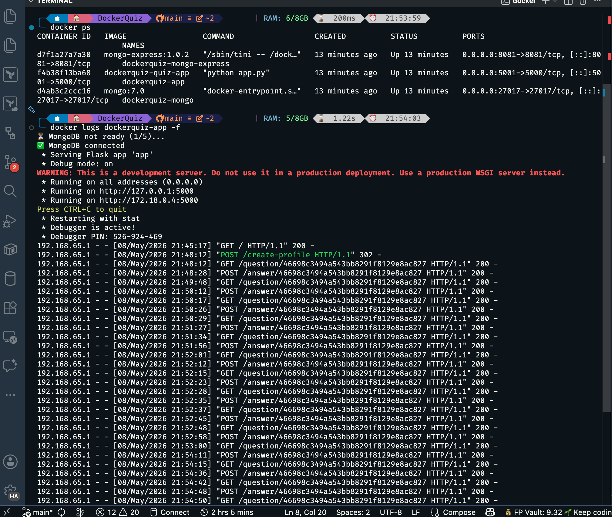

```bash
# Stream live logs from MongoDB
docker logs dockerquiz-mongo -f
```
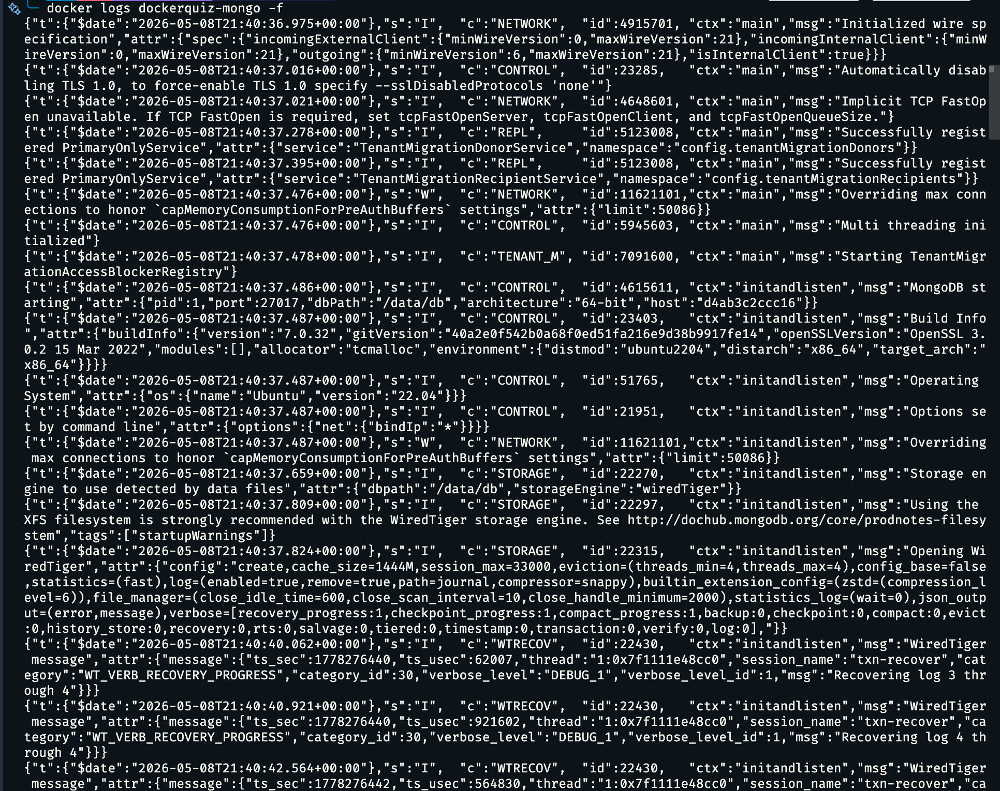


```bash
# Open a shell inside the running quiz-app container
docker exec -it dockerquiz-app bash

# Open a MongoDB shell and query your data directly
docker exec -it dockerquiz-mongo mongosh

# Inside mongosh — explore your collections:
use dockerquiz
db.profiles.find().pretty()
db.results.find().pretty()
db.quiz_states.find().pretty()
```

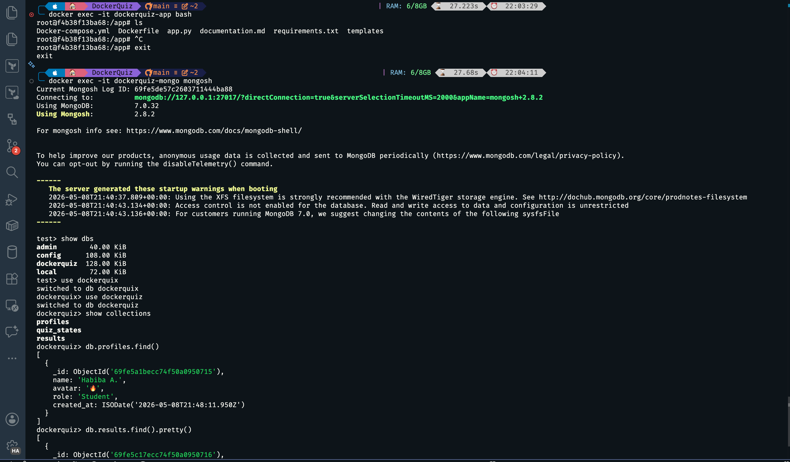


```bash
# See all Docker networks on your machine
docker network ls

# Inspect quiz-network — see which containers are connected
docker network inspect dockerquiz_quiz-network
```

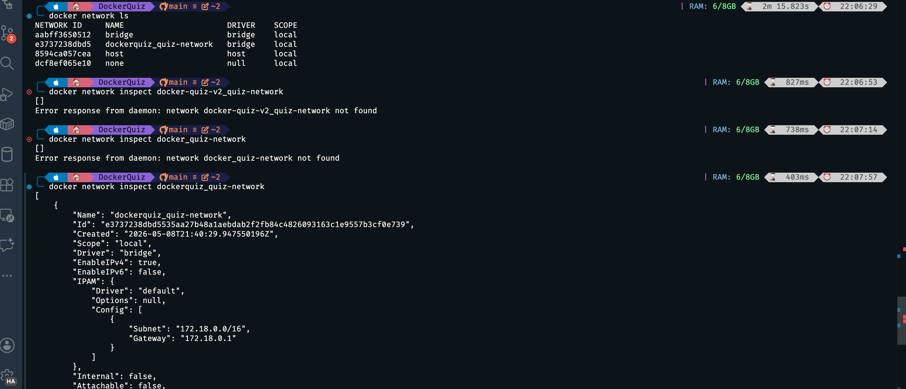

```bash
# See all volumes
docker volume ls
```
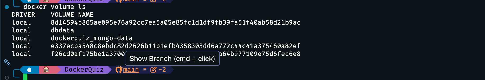


---

## Issues Faced and Resolutions

### Issue 1: App container exiting with code 0 (restart loop)

**Symptom:**
```
dockerquiz-app exited with code 0 (restarting)
```
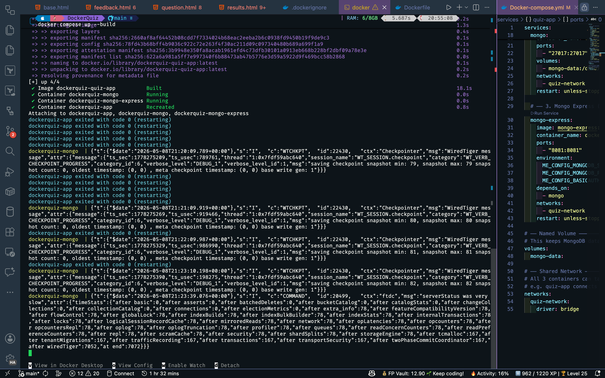

**Cause:**

I had not fully written the source code in `app.py`. The file was missing the `app.run()` call at the bottom, so Python would import Flask, define the app and helper functions, reach the end of the file, and exit cleanly with code 0. Since no web server was ever started, Docker kept restarting the container in an infinite loop.

**Resolution:**

I completed the `app.py` source code and added the missing entry point at the bottom of the file:

```python
if __name__ == "__main__":
    app.run(host="0.0.0.0", port=5000, debug=True)
```

---

### Issue 2: Port conflict on port 5000

**Symptom:**
My browser showed a "page not found" error at `localhost:5000`, and an important process already running on my machine was occupying port `5000`.

**Cause:**

Port `5000` was already in use by another process on my machine that I could not kill. The default Docker Compose port mapping of `5000:5000` meant the host port was unavailable.

**Resolution:**

Rather than killing the existing process, I modified `docker-compose.yml` to map the host port to `5001` instead, while keeping Flask running on its default port `5000` inside the container:

```yaml
ports:
  - "5001:5000"   # host 5001 → container 5000
```


The app then became accessible at `http://localhost:5001` with no conflict.

---

## Conclusion and Reflection
